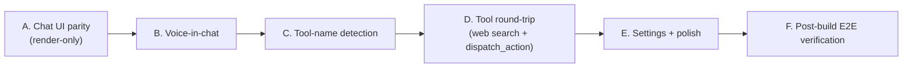

# Bridge Handy Android v1 to Handy V1 macOS parity

## Goal

Bring the existing Android v1 scope to feature-parity with the V1 macOS app for every row of the status table, without expanding scope into v2 features (pointing-arrow, companion cursor, workflow runner, tutor idle observations).

## Phase map



Each phase is independently shippable and is followed by a DL-XXX entry in [DEBUG_LOG.md](DEBUG_LOG.md) per the repo's convention.

## Architectural seams we preserve

- `:core` stays pure Kotlin — every new abstraction (ToolRunner, ForegroundAppMonitor) gets an interface here and an implementation in `:android-runtime` or `:app`.
- All prompt strings stay in [core/src/main/kotlin/com/handy/core/prompts/PromptCatalog.kt](core/src/main/kotlin/com/handy/core/prompts/PromptCatalog.kt). No prompt drift.
- `ConversationOrchestrator` stays the single event emitter — ViewModels never talk to `LlmClient` directly.
- `ChatMessage` round-trip format with macOS is NOT modified.

---

## Phase A — Chat UI parity (render-only changes)

Touches only [app/src/main/kotlin/com/handy/app/chat/ChatActivity.kt](app/src/main/kotlin/com/handy/app/chat/ChatActivity.kt) and [app/src/main/kotlin/com/handy/app/chat/ChatViewModel.kt](app/src/main/kotlin/com/handy/app/chat/ChatViewModel.kt). Zero backend changes.

1. **Extend `ChatUiState`**
   - Add `currentToolName: String = "Handy"`, `toolDetectionState: ToolDetectionState = IDLE` (new enum in `:app`), `voiceState: VoiceUiState = IDLE`, `pendingTranscript: String = ""`.
   - Only defaulted fields; zero behavior change yet — Phases B/C will drive them.

2. **`MessageRow` full-fidelity bubble** (mirror [`MessageBubbleView`](Handy%20V1%20(macOS%20app)/Handy/Views/ChatInterfaceView.swift) lines 419–530):
   - Left-side assistant avatar (hand icon in a 28dp circle), right-side "You" pill.
   - Italic search-tools label above the bubble:
     ```kotlin
     if (message.searchToolsUsed.isNotEmpty()) {
       Text(
         text = message.searchToolsUsed.joinToString(" · ") { labelFor(it) },
         fontStyle = FontStyle.Italic,
         color = HandyColors.Accent.copy(alpha = 0.8f),
         fontSize = 10.sp,
       )
     }
     ```
     with `labelFor` mirroring V1's mapping (`web_search → "web searched"` etc.).
   - 3 pulsing dots when `message.isStreaming`.
   - `text-selection` enabled; `h:mm a` timestamp below the content.

3. **Header bar** — replace `TopAppBar` with a custom row:
   - "Handy" 20sp heavy + status dot (green idle, accent responding, accent-with-halo listening, amber processing).
   - 3-bar listening indicator (right-aligned) when `voiceState == LISTENING`.
   - Hover phrase roster dropped on mobile (hover doesn't exist); keep the dot + halo.

4. **Tool-name bar** (new composable) — renders between header and message list:
   - `IDLE` / populated → lowercase tool name in accent color with a "Change" TextButton.
   - `DETECTING` → "Detecting app..." + tiny progress indicator.
   - `FAILED` → 3 amber fading dots.
   - Edit mode swaps to an `OutlinedTextField` + "Done" button; on commit, calls `viewModel.setToolName(…)`.

5. **Loading-verb rotation** — move the single-shot `OrchestrationEvent.LoadingVerb` handling from ViewModel into a `Timer` that re-picks a verb every 2.5s while `isStreaming && loadingVerb != tool-specific`. Tool-specific verbs from `WebSearchStatus` events freeze the rotation.

6. **Error UX** — in the `OrchestrationEvent.Error` branch:
   - Finalise the in-flight streaming row to `accumulatedText.ifEmpty { "(response failed)" }` and mark `isStreaming = false`.
   - Append a `SYSTEM`-role `ChatMessage` with `"Error: ${event.message}"`.
   - Keep the banner behavior.

7. **Scroll polish** — match V1: scroll on `messages.size` change AND on `isStreaming` flip (both edges).

Acceptance: with `voiceState`/`currentToolName` still hardcoded, the chat renders bubbles with avatars, timestamps, streaming dots, tool-name bar showing "Handy", rotating loading verbs. No functional regressions.

DL entry: DL-00X — "Chat surface parity with V1 MessageBubbleView."

---

## Phase B — Voice in chat

Makes the chat screen behave like V1's `ChatInterfaceView` + `HandyManager.startVoiceInput` / `stopVoiceInput`.

1. **`ChatViewModel` holds voice state** — inject `VoiceController`:
   ```kotlin
   private val voiceController: VoiceController,
   ```
   - Collect `voiceController.state` → `voiceState` in `ChatUiState`.
   - Collect `voiceController.latestPartial` → `pendingTranscript`.
   - `fun startVoice()`: calls `voiceController.start()`; if `false`, emit `errorBanner` ("Mic permission missing. Enable in Settings.").
   - `fun stopVoice()`: launches `voiceController.stopAndAwaitFinal()`, and **if the transcript is non-empty, calls `send(transcript, fromVoice = true)` automatically** (the macOS auto-send contract, [HandyManager.swift](Handy%20V1%20(macOS%20app)/Handy/Services/HandyManager.swift) line 1127).

2. **Composer split on `voiceState`** — in `ChatComposer`:
   - When `voiceState == LISTENING`, replace the `OutlinedTextField` with a live partial-transcript `Text` ("Listening..." in tertiary color when blank, full text in primary when populated), mirroring [ChatInterfaceView.swift](Handy%20V1%20(macOS%20app)/Handy/Views/ChatInterfaceView.swift) lines 345–350.
   - Add a **mic `IconButton`** to the left of the text field: `Mic` icon (outlined) when IDLE, `MicFill` (accent background, error-subtle halo) when LISTENING.
   - Mic onClick: `if (voiceState == IDLE) startVoice() else stopVoice()`.

3. **Widget → chat consolidation** — the existing [FloatingWidgetOverlayService](app/src/main/kotlin/com/handy/app/overlay/FloatingWidgetOverlayService.kt) path (long-press → open chat with `EXTRA_VOICE_MESSAGE`) stays. But if the widget's voice session is interrupted (user drags mid-listen), we already call `voiceController.cancel()` — good. ChatViewModel's subscription to `VoiceController.state` auto-resets when that happens.

4. **Header wiring** — `voiceState == LISTENING` now animates the 3-bar indicator and the dot halo from Phase A.

Acceptance:
- Tapping mic inside chat starts live partial transcription; words stream into the composer in real time.
- Releasing mic auto-sends whatever was transcribed; empty transcripts are a silent no-op (no stuck bubble).
- Long-pressing the widget and releasing still deep-links into chat with `EXTRA_VOICE_MESSAGE` (existing behavior preserved).

DL entry: DL-00X — "Wire VoiceController into chat composer; auto-send on stop."

---

## Phase C — Tool-name detection

Brings [HandyManager.resolveToolNameWithAutoSwitch](Handy%20V1%20(macOS%20app)/Handy/Services/HandyManager.swift) (lines 596–674) to Android.

1. **New seam in `:core`**: `ForegroundAppSnapshot(packageName, appLabel, umbrellaSiteLabel?)` and `interface ForegroundAppMonitor { val flow: Flow<ForegroundAppSnapshot?> }`.

2. **Runtime impl** in [app/src/main/kotlin/com/handy/app/accessibility/HandyAccessibilityService.kt](app/src/main/kotlin/com/handy/app/accessibility/HandyAccessibilityService.kt):
   - Consume `TYPE_WINDOW_STATE_CHANGED` events; publish `ForegroundAppSnapshot` to a `MutableSharedFlow` on a companion-object singleton.
   - Debounce (200ms) and filter out our own package + IME packages.
   - App label resolved via `PackageManager.getApplicationLabel(packageInfo)`.

3. **Browser umbrella-site detection** (reduced scope vs macOS, which had AppleScript; we use what's in `AccessibilityNodeInfo`):
   - For browser packages (`com.android.chrome`, `org.mozilla.firefox`, `com.brave.browser`, `com.microsoft.emmx`, `com.opera.browser`, Samsung Internet), walk the node tree for a URL-bar view (`viewIdResourceName` suffix `url_bar` / `urlbar_title`) and parse the host.
   - Umbrella label derived from host (`google.com` → "Google", `github.com` → "GitHub", etc.) via a small allowlist mirroring [core/src/main/kotlin/com/handy/core/tool/UmbrellaSiteLabels.kt](core/src/main/kotlin/com/handy/core/tool/UmbrellaSiteLabels.kt).
   - If URL cannot be resolved, fall back to the app label alone.

4. **`ChatViewModel` integration**:
   - Inject `ForegroundAppMonitor`.
   - On each snapshot, set `currentToolName = snapshot.displayLabel`, `toolDetectionState = DETECTED`, swap the `ToolContext` used for the next `OrchestrationRequest`, and re-subscribe `historyStore.observe(newKey)`.
   - If the accessibility service is not granted, `snapshot == null` → `toolDetectionState = FAILED` (amber 3-dot trail) + tool name stays as the last user-set value or "Handy".
   - `fun setToolName(name: String)` — user override; persists to DataStore as a last-used-override + updates `ToolContext.appLabel` (NOT `packageName` — the package is always the real foreground one).

5. **Intro prefix fix** — now that `currentToolName` is real, `IntroPrefix.forTurn("Gmail", 0)` actually produces "so we are working with Gmail, let me help you with your query. ", matching V1.

Acceptance:
- Open Gmail → switch to Handy chat → bar shows "Gmail", first-turn prefix uses "Gmail".
- Open Chrome → navigate to github.com → Handy chat bar shows "GitHub", and the per-tool history is NOT mixed with the Chrome-home history.
- Tap "Change" → type "My Project" → prefix/history key switch within 200ms.
- Accessibility disabled → 3 amber dots in the bar; intro prefix reads "Handy".

DL entry: DL-00X — "Foreground-app tool-memory switching via accessibility events."

---

## Phase D — Tool round-trip (web search + dispatch_action)

The biggest block. Mirrors [ClaudeAPIService.streamResponseWithToolsAsync](Handy%20V1%20(macOS%20app)/Handy/Services/ClaudeAPIService.swift) (line 634).

1. **Port `WebSearchService` to `:android-runtime`**
   - New file: `android-runtime/src/main/kotlin/com/handy/runtime/websearch/WebSearchService.kt`.
   - Ports all three methods verbatim (Brave Search, Jina Reader, GitHub Search) from [Handy V1 (macOS app)/Handy/Services/WebSearchService.swift](Handy%20V1%20(macOS%20app)/Handy/Services/WebSearchService.swift):
     - `searchBrave(query, count)` — `GET https://api.search.brave.com/res/v1/web/search` with `X-Subscription-Token`.
     - `fetchPage(url)` — `GET https://r.jina.ai/<encoded>` with optional `Bearer` from `KeyStore.KEY_JINA`.
     - `searchGitHub(query, language?)` — `GET https://api.github.com/search/repositories` with optional `Bearer` from `KeyStore.KEY_GITHUB`.
   - Uses the existing shared `OkHttpClient` from `RuntimeModule`.
   - `formatSearchResults` / `formatGitHubResults` helpers ported verbatim (they go into Claude's `tool_result`).
   - Error taxonomy ported: `NoApiKey`, `HttpError(code, cleanMsg)`, `NetworkError`, `DecodingError`.

2. **`:core` ToolRunner interface**
   ```kotlin
   interface ToolRunner {
     suspend fun run(name: String, inputJson: String): ToolResult
   }
   sealed class ToolResult {
     data class Ok(val text: String): ToolResult()
     data class Failed(val message: String): ToolResult()
   }
   ```
   - New file [core/src/main/kotlin/com/handy/core/llm/ToolRunner.kt](core/src/main/kotlin/com/handy/core/llm/ToolRunner.kt).

3. **`:android-runtime` ToolRunner impl** — `HandyToolRunner` dispatches by name:
   - `web_search` → `WebSearchService.searchBrave` → `formatSearchResults`.
   - `github_search` → `WebSearchService.searchGitHub` → `formatGitHubResults`.
   - `fetch_page` → `WebSearchService.fetchPage` (capped at 16k chars, matching V1 line 152).
   - `dispatch_action` → `AssistantActionJsonParser.parse(inputJson)` → `AndroidIntentDispatcher.dispatch(...)` → return a short status string back to Claude (e.g. `"dispatched: SET_TIMER 600s"` or `"needs_confirmation: Dial +15551234567?"`). Destructive actions surface a confirmation sheet on the chat side that, on confirm, calls `dispatchConfirmed` — the tool result goes back as `"user_confirmed"` / `"user_declined"`.

4. **`availableTools(...)` builder in `:core`**
   - New file [core/src/main/kotlin/com/handy/core/llm/AvailableTools.kt](core/src/main/kotlin/com/handy/core/llm/AvailableTools.kt):
     ```kotlin
     fun availableTools(
       webSearchEnabled: Boolean,
       hasBraveKey: Boolean,
       intentDispatchEnabled: Boolean,
     ): List<ToolDefinition>
     ```
   - Exactly mirrors V1's `ClaudeAPIService.availableTools` gating (web_search only if hasBraveKey; github_search + fetch_page when webSearch on; dispatch_action when intent on).
   - Schemas are `kotlinx.serialization.json` JsonObjects rendered to strings (keeps `ToolDefinition.inputSchemaJson` contract).

5. **`LlmClient` contract change** — add an optional `toolRunner: ToolRunner?` to `LlmRequest`, or (cleaner) introduce a new `streamToolAwareChat` path and leave `streamChat` untouched. I'll use the latter so non-tool paths don't pay the complexity cost:
   ```kotlin
   interface LlmClient {
     fun streamChat(request: LlmRequest): Flow<LlmChunk>
     fun streamToolAwareChat(request: LlmRequest, runner: ToolRunner): Flow<LlmChunk>
   }
   ```
   - Default implementation in `ClaudeLlmClient`: the tool-aware variant loops up to N iterations (cap at 5 per V1) — each iteration opens a fresh SSE to `/v1/messages` with the accumulated message list (including `tool_use` blocks Claude emitted and `tool_result` blocks we produced). Stops when the response's `stop_reason != "tool_use"`.

6. **Orchestrator integration** — [ConversationOrchestrator](core/src/main/kotlin/com/handy/core/orchestrator/ConversationOrchestrator.kt):
   - Pass `request.tools` from `availableTools(...)` called in `ChatViewModel.send`.
   - When `tools.isNotEmpty()`, invoke `streamToolAwareChat(request, toolRunner)`.
   - On each `LlmChunk.ToolCall`, emit the existing `OrchestrationEvent.ToolCall` + `WebSearchStatus` events (already present; we just start firing them).

7. **ChatViewModel — stop no-op'ing tool events**
   - Replace the Phase-3 comment at [ChatViewModel.kt lines 98–104](app/src/main/kotlin/com/handy/app/chat/ChatViewModel.kt) with:
     - `ToolCall` → append `chunk.name` to a per-turn `MutableList<String>`.
     - `WebSearchStatus` → overwrite `loadingVerb` (freezes rotation until `AssistantTurnFinalized`).
   - On `AssistantTurnFinalized`, write the collected tool list into the finalised assistant `ChatMessage.searchToolsUsed`. (The orchestrator already emits these in its `AssistantTurnFinalized` payload — we just persist them.)

8. **Settings — bind the Hilt graph to the real performer**
   - [android-runtime/src/main/kotlin/com/handy/runtime/di/RuntimeModule.kt](android-runtime/src/main/kotlin/com/handy/runtime/di/RuntimeModule.kt): replace `provideActionPerformer` to return a real adapter around `AndroidIntentDispatcher`, and add `provideToolRunner(...)` + `provideWebSearchService(...)` providers.

Acceptance:
- `webSearchEnabled = true` + valid Brave key → "latest React Native version" query surfaces italic label "web searched" above the assistant bubble and the loading strip reads "Searching the web..." while the tool runs.
- `github_search` and `fetch_page` work even without a Brave key (graceful degradation matches V1, [HandyManager.swift](Handy%20V1%20(macOS%20app)/Handy/Services/HandyManager.swift) line 346 comment).
- "Set a 10-minute timer" → confirmation-free (`StartTimer` is non-destructive) → Clock app opens → "dispatched: SET_TIMER 600s" goes back to Claude, which closes with a short confirmation.
- "Call mom" → confirmation sheet appears; user taps Continue → `ACTION_DIAL` fires, tool-result `"user_confirmed"` flows back.

DL entry: DL-00X — "Tool round-trip: port WebSearchService + ToolRunner + Claude tool loop."

---

## Phase E — Settings + polish

1. **Credential fields for Jina + GitHub** in [SettingsActivity.kt](app/src/main/kotlin/com/handy/app/settings/SettingsActivity.kt): two additional `CredentialField` rows under the Brave field. SettingsViewModel already has the plumbing — just add `setJinaKey` / `setGithubKey` mirrors.
2. **Settings sub-headers** — "Web search" section groups Brave + Jina + GitHub + the `webSearchEnabled` toggle together; a short explanatory caption matches V1's Settings > Brain > Web Search copy.
3. **`OrchestrationEvent.UserTurnPersisted`** — ChatViewModel already gets it but ignores it. Wire it: immediately append the user bubble instead of waiting for the streaming delta, so the user's message renders as soon as they hit send (cosmetic feel fix).

Acceptance:
- Jina / GitHub keys persist through process death (EncryptedSharedPreferences).
- Typing "hi" and pressing send: user bubble renders in <50ms; assistant streaming row appears alongside it.

DL entry: DL-00X — "Settings completeness + user-turn render latency."

---

## Phase F — Post-build End-to-end verification plan

Run these on a physical Android 13+ device with Anthropic + Brave keys configured. Each pass must be green before we call the parity work done.

### F.1 Setup (one-time)

- Install release/debug APK; complete onboarding (grant Mic, Overlay, Accessibility, Notification).
- In Settings: paste valid Anthropic + Brave keys; toggle "Web search" on; leave Assistant Mode = Help Only.

### F.2 Core chat flow

1. Open chat via widget tap → header shows "Handy" bold + green status dot. Tool-name bar reads "Handy" (no foreground app switch yet).
2. Type "hi" → user bubble with right-align + "You" pill; assistant bubble with hand avatar + timestamp + 3 pulsing dots while streaming; loading verb rotates every ~2.5s; dots disappear when done; intro prefix reads "so we are working with Handy, let me help you with your query. …".

### F.3 Voice-in-chat

1. Tap mic → dot halos in accent; 3 bars animate in header; composer swaps to "Listening..." placeholder.
2. Speak "what is dns" → words stream into composer as they're recognised.
3. Tap mic again → composer clears; user bubble contains the final transcript; assistant responds. **No "open chat" intermediate step**, no lost transcript.
4. Mic → speak nothing → tap mic again → no bubble appended, no error banner.
5. Long-press the widget → speak "open youtube" → release → chat launches with the utterance already sent; `dispatch_action: OpenApp` fires and YouTube launches.

### F.4 Tool-name auto-switching

1. Switch to Gmail → return to Handy chat → tool bar updates to "Gmail" within 500ms (no manual refresh).
2. Switch to Chrome → navigate to github.com → return to chat → bar reads "GitHub" (umbrella-site detection), and the chat history loaded is the GitHub-keyed one (first message shows first-turn prefix "so we are working with GitHub, …").
3. Switch Chrome tab to stackoverflow.com → return → bar reads "Stack Overflow"; history swaps; first-turn prefix for the new site fires.
4. Tap "Change" → type "Hackathon" → Done → bar updates; new history key in effect; kill + relaunch → context persisted.
5. Disable the accessibility service → return to chat → 3 amber dots trail in the bar; tool defaults to "Handy"; no crash.

### F.5 Web search round-trip

1. Ask "what's the latest React Native version" → loading strip immediately reads "Searching the web..."; response streams in; final bubble has italic "web searched" label above the text.
2. Ask "best kotlin coroutines library on github" → label reads "github searched".
3. Ask "summarise https://kotlinlang.org/docs/coroutines-overview.html" → label reads "page fetched".
4. Remove the Brave key → ask a web query → the response falls back gracefully: tool-use still fires `github_search` / `fetch_page` if relevant; general-web queries return a "add a Brave Search API key" nudge (V1 parity, [PromptCatalog.webSearchAddendum hasBraveKey=false branch](core/src/main/kotlin/com/handy/core/prompts/PromptCatalog.kt)).
5. Toggle Web search off → ask a web-flavored question → no italic label; no `web_search` event in logcat (Timber); plain Claude answer only.

### F.6 Intent dispatch (`dispatch_action`)

1. "Set a 10-minute timer" → Clock opens with 600s pre-filled; assistant bubble confirms "Started a 10-minute timer."
2. "Open Instagram" → Instagram launches; bubble confirms.
3. "Call 9999999999" → confirmation sheet appears; tap Continue → dial intent fires → bubble confirms; tap Cancel → bubble says the user declined.
4. "Text Sarah hi" → confirmation sheet appears (destructive heuristic).
5. "What's the capital of France" → assistant answers with plain text — no dispatch attempt.

### F.7 Error surface

1. Set Anthropic key to garbage → send a message → error banner appears; streaming row is finalised to "(response failed)"; system bubble with `Error: …`; banner dismissable.
2. Pull network cable / airplane mode → send → banner shows network error message; no hung spinner.
3. Kill process mid-stream → relaunch → last user bubble persisted, no ghost streaming row on return.

### F.8 Scroll + keyboard

1. Send 20 messages → list auto-scrolls to bottom on every send and on stream-finalised.
2. Open keyboard → composer stays above IME (`imePadding`); bubbles don't jump.
3. Long-tap an assistant bubble → text selection handles appear; copy works.

### F.9 Prompt correctness

- With screen text capture enabled, confirm the system prompt sent to Claude contains:
  - `"on **android**"` (not macOS),
  - the `<screen_ui>` block when accessibility is on,
  - `dispatch_action` addendum,
  - web-search addendum iff `webSearchEnabled` (and the correct hasBraveKey branch).
- Snapshot test: extend [core/src/test/kotlin/com/handy/core/prompts/PromptCatalogTest.kt](core/src/test/kotlin/com/handy/core/prompts/PromptCatalogTest.kt) to lock these assertions.

### F.10 Automated test gate

- `./gradlew :core:test` green.
- `./gradlew :android-runtime:test` green.
- `./gradlew :app:connectedAndroidTest` green on Pixel 7 API 35 emulator (existing Os1/Os2/Os5 plus two new voice-path and tool-bar tests).

---

## Out of scope for this pass

Explicitly NOT in this plan (these are v2):
- Pointing-arrow overlay / `CompanionCursorManager`.
- Guided-workflow runner + `submit_guided_workflow` tool.
- Tutor-mode idle-triggered observations.
- Speculative pre-fetch via `quickSearchCheck` (nice-to-have; decouples cleanly later).
- Hover-roster rotating status phrases (no hover on mobile).

## Risk register

- **ClaudeLlmClient tool-loop re-entrancy**: the existing single-shot `callbackFlow` is simple; the loop variant is a state machine across N SSE sessions. Mitigation: land `streamToolAwareChat` as a new method, keep `streamChat` untouched, and cover the loop in a unit test against a fake SSE server.
- **Accessibility event spam**: `TYPE_WINDOW_STATE_CHANGED` fires often. Mitigation: debounce 200ms + ignore self package + compare against last snapshot before emitting.
- **Tool-use cost**: every web-search round-trip is 2+ Claude calls. Mitigation: cap at 5 tool iterations per user turn (V1 parity) + log the count in Timber.

## DEBUG_LOG discipline

Each phase appends one DL-XXX entry in the SAME commit as the fix, per the rule in [.cursor/rules/20-debug-log.mdc](.cursor/rules/20-debug-log.mdc).