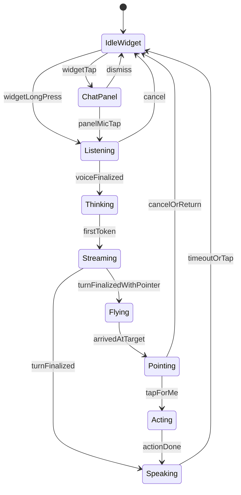

# Claude Design Brief — Handy Android (Tight Contract)

This document hands the entire current state of the Handy Android product over to a senior UX/UI designer (you, Claude) so that the gaps in the existing design system can be closed and the four explicit fixes called out in §6 can be executed cleanly. It is exhaustive on purpose — every screen, every element, every copy string, every dp/sp/hex value, every state.

Read it linearly. The structure is:

- §0 posture and what you may / may not change
- §1 product + architecture primer (so you understand what is technically possible)
- §2 existing design system inventory (tokens, primitives, drawables)
- §3 screen-by-screen + element-by-element catalog (current state, verbatim copy)
- §4 strings inventory (with shadow / unused strings flagged)
- §5 locked verbatim ports you must not touch
- §6 the four explicit asks — these are the only authorized changes
- §7 hard guardrails
- §8 the deliverable I expect back from you

The product is built. This is a design pass to bring everything into one coherent system and execute the named fixes — not a redesign.

---

## 0. How to read this brief — tight contract

You are acting as a senior product designer reviewing a real shipped Android app. The app already has a design system you authored in an earlier pass (warm-amber on near-black glass, Inter, single accent, `HandyDimens` radii, four-bubble taxonomy). That system covers some screens but not all. Your job in this pass is:

1. Read the catalog in §3 and identify which elements / screens / states are not yet expressed in your existing system.
2. Express those gap elements using the existing tokens in §2 — do not introduce new colors, new dp values, new type styles, new motion timings, or new drawables.
3. Execute the four explicit asks in §6 — these are the only authorized behavioural / visual changes. Everything else stays exactly as it is today.

Hard rules:

- **No new tokens.** If something genuinely cannot be expressed using the existing palette / dimens / type / motion, flag it inline as `[GAP]` with a one-line note proposing which existing token best approximates it. The user will decide whether to add new tokens in a separate pass.
- **No new drawables.** If a screen needs an icon you do not already have in the inventory in §2.8, propose a `androidx.compose.material.icons.outlined.*` substitute by name. Do not draw new vectors.
- **No motion changes.** All Bezier flight math, all animation durations, all easings, all dwell parameters are locked (see §5.3 and §7).
- **No copy changes outside §6.4.** Only the Settings-screen subtitles called out in §6.4 are in scope for copy review. Verbatim ports in §5 are immutable.
- **No state-machine changes.** `OverlayMode`, `BuddyState`, `BuddyBubble`, `OverlayPanelState`, `PanelContent` are runtime contracts. You can re-express how each state looks visually within existing tokens, but you cannot add or remove states.

When in doubt, prefer minimal change. The product is shipping; this is a polish + reconciliation pass, not a brand refresh.

---

## 1. Product + architecture primer

### 1.1 What Handy is

Handy is an on-screen AI assistant for Android. The user speaks to it (long-press the floating widget) or types to it (tap the widget to open a bottom-sheet quick-chat panel, or the full `ChatActivity` window). It reads the visible screen via the Accessibility service, sends the user message plus that context to Claude over Server-Sent Events, streams the response back, and may "fly" to a UI element on the user's screen and label it with a bubble — that is what `[POINT:...]` markers in the model output trigger.

The product borrows its visual direction from the shipped macOS Handy. The Android build is a clean-room re-implementation with strict module boundaries, no Room database, no UI in the runtime layer, and Compose-only rendering.

### 1.2 Three-module architecture

The app is split into three Gradle modules with strict, lint-enforced boundaries:

- **`:core`** — pure Kotlin/JVM. No `android.*`, no `androidx.*`, no Compose, no `Context`, no `SharedPreferences`. Holds the orchestrator, prompt catalog, parsing, contracts, settings data classes, sealed states (`OverlayPanelState`, `BuddyBubble`, `CaptureResult`, `IntentResult`, `PerformResult`, `BrainDecision`, `OrchestrationEvent`, `LlmChunk`, `ToolResult`).
- **`:android-runtime`** — Android adapters only. LLM clients (`ClaudeLlmClient`, `GeminiCloudLlmClient`, `SwitchingCloudLlmClient`, `GeminiNanoLocalGenAiClient`), capture pipeline, STT/TTS, web search, storage (DataStore, EncryptedSharedPreferences, JSON history), accessibility marks, semantic pointer resolver, intent dispatcher, audit store, Hilt module. **No UI**, **no manifest-declared components**.
- **`:app`** — all manifest-declared components (activities, services, accessibility service) and all Compose UI. Depends on `:core` and `:android-runtime`. Owns: `HandyApplication`, `OnboardingActivity`, `ChatActivity`, `SettingsActivity`, `DiagnosticsActivity`, `AssistantForegroundService`, `MediaProjectionCaptureService`, `HandyAccessibilityService`, `FloatingWidgetOverlayService`, `OverlayChatPanelService`, `HandyQuickSettingsTileService`, `HandyAssistIntentService`, `HandyNotificationListenerService`, the theme files, all Compose screens, and the overlay presentation layer.

A unit test fails the build if `android.*` references leak into `:core`.

### 1.3 Manifest surface (what the OS sees)

Activities (`com.handy.app`):

- `.onboarding.OnboardingActivity` — `MAIN`/`LAUNCHER`, `singleTop`, exported.
- `.chat.ChatActivity` — `singleTask`, `adjustResize`, not exported.
- `.settings.SettingsActivity` — not exported.
- `.diagnostics.DiagnosticsActivity` — not exported.

Services:

- `.service.AssistantForegroundService` — `foregroundServiceType="specialUse|microphone"`. Carries `<property android:name="android.app.PROPERTY_SPECIAL_USE_FGS_SUBTYPE" android:value="@string/special_use_fgs_subtype" />`. Owns the microphone during voice capture and is the long-lived lifecycle anchor.
- `.service.MediaProjectionCaptureService` — `foregroundServiceType="mediaProjection"`. Used only on API 26–29 as the screen-capture fallback path.
- `.accessibility.HandyAccessibilityService` — exported, `BIND_ACCESSIBILITY_SERVICE`, with `<meta-data android:resource="@xml/accessibility_service_config" />`.
- `.overlay.FloatingWidgetOverlayService` — the floating widget overlay window.
- `.overlay.OverlayChatPanelService` — the bottom-sheet quick-chat overlay window (V2 primary entry).
- `.tile.HandyQuickSettingsTileService` — Quick Settings tile, `BIND_QUICK_SETTINGS_TILE`.
- `.assist.HandyAssistIntentService` — optional Assist entry, `ACTION_ASSIST`.
- `.notifications.HandyNotificationListenerService` — `BIND_NOTIFICATION_LISTENER_SERVICE`.

Permissions: `RECORD_AUDIO`, `SYSTEM_ALERT_WINDOW`, `POST_NOTIFICATIONS`, `FOREGROUND_SERVICE`, `FOREGROUND_SERVICE_SPECIAL_USE`, `FOREGROUND_SERVICE_MICROPHONE`, `FOREGROUND_SERVICE_MEDIA_PROJECTION`, `INTERNET`, `ACCESS_NETWORK_STATE`.

Package visibility `<queries>` (no `QUERY_ALL_PACKAGES`): RecognitionService, http/https/geo VIEW, tel DIAL, mailto SENDTO, text/plain SEND, MAIN/LAUNCHER, WEB_SEARCH, SET_ALARM, SET_TIMER.

App-level: `allowBackup="false"`, `usesCleartextTraffic="false"`, `networkSecurityConfig="@xml/network_security_config"`, `targetSdk=36`, `minSdk=26`.

### 1.4 State vocabulary

The whole UX is parametrised by three orthogonal enums plus one sealed `BuddyBubble` type. These are the runtime contracts — design must respect them, not redesign them.

`OverlayMode` (window-flag intent): `IdleWidget`, `ChatPanel`, `Flying`, `Pointing`, `Acting`.

`BuddyState` (what the buddy is doing): `DOCKED`, `LISTENING`, `THINKING`, `STREAMING`, `FLYING`, `POINTING`, `ACTING`, `SPEAKING`, `DRAGGING`.

`WidgetState` (gesture-layer view-state inside `WidgetContent`): `IDLE`, `TOUCHED`, `DRAGGING`, `LISTENING`, `THINKING`, `FLYING`, `POINTING`. The presenter maps `BuddyState` → `WidgetState` (see §3.1.2).

`BuddyBubble` (sealed): `Transcript(text)`, `Action(text)`, `Response(text)`, `Navigation(text)`. Only one is shown at a time.

`PanelContent` (the chat-panel slice of state): greeting, quickPrompts, draft, isListening, partialTranscript, isStreaming, streamingDelta, loadingVerb, recentResponsePreview, errorBanner, pendingConfirmation, snapshot.

State diagram (high-level lifecycle a user actually traverses):

### 1.5 One voice turn end-to-end (data flow)

So you can grasp where each piece of UI shows up:

1. User long-presses the floating widget (400 ms threshold). `FloatingWidgetOverlayService` calls `voiceController.start()`, sets `WidgetState.LISTENING`, fires `HapticFeedbackConstants.LONG_PRESS`, and `presenter.onWidgetLongPressArmed()` puts an empty yellow `BuddyBubble.Transcript("")`.
2. `AndroidSttClient` (wrapping `SpeechRecognizer`) emits `SttEvent` partials. `voiceController.latestPartial` flows into `presenter.updatePartialTranscript(...)` which updates the yellow bubble in real time.
3. User releases. `voiceController.stopAndAwaitFinal()` returns the final transcript. If overlay-panel mode is enabled, `presenter.onWidgetTap()` opens the panel, snapshot is captured (`PanelSnapshot` = packageName + appLabel + accessibility marks + cached at tap), and `OverlayPanelBridge.submitFromVoice(transcript)` enqueues the turn.
4. `OverlayChatPipeline.runTurn` builds an `OrchestrationRequest` and runs `ConversationOrchestrator.converse(request)`.
5. The orchestrator emits `OrchestrationEvent.LoadingVerb(LoadingVerbs.random())`, builds the system prompt via `PromptCatalog.buildSystemPrompt(...)` (with screen-text and intent-tool addendums), and calls `LlmClient.streamToolAwareChat(...)` (currently `SwitchingCloudLlmClient` → `ClaudeLlmClient`).
6. SSE chunks come back as `LlmChunk`. The orchestrator emits `OrchestrationEvent.StreamingDelta(accumulated)` for text, `ToolCall(...)` for tool invocations, and `WebSearchStatus(text)` when a web tool's overlay status line should change. `HandyToolRunner` executes tools (`web_search`, `fetch_page`, `github_search`, `dispatch_action`).
7. On completion the orchestrator emits `OrchestrationEvent.AssistantTurnFinalized(chatText, ttsText, overlaySpokenText, pointing, searchToolsUsed)`. `pointing` is an `AssistantMarkupParser.PointingResult`.
8. `OverlayChatPipeline` calls `presenter.onResponseFinalized(overlayClamped, chatText)`. If `pointing.hasPointer`, after a 180 ms delay it dismisses the panel and triggers `BuddyFlightDriver.flyTo(...)` which uses `SemanticPointerResolver` against the cached snapshot to resolve role/text/desc/viewId/fuzzy → bounds, then runs the Bezier flight.
9. The widget swaps `HandMarkIcon` → `PointerHandIcon` via `Crossfade(200ms)`, flies along the Bezier, lands, and the green `BuddyBubble.Response(label)` follows it. Persistent dwell pulse runs until cancelled.

That is the ONE path the user calls out in their brief — widget input, listening, bottom sheet, query, thoughts streaming, hand → pointer transition, flight, bubble at landing. Every visual element along that path is enumerated screen by screen below.

---

## 2. Existing design system inventory

These are the tokens you authored in the prior pass. Use them. Do not add new ones in this pass.

### 2.1 Color tokens — `HandyColors` (`app/src/main/kotlin/com/handy/app/theme/DesignSystem.kt`)

Active tokens (use these):

| Token | Hex / definition |
|---|---|
| `PageBg` | `0xFF07070A` |
| `Background` | `0xFF07070A` (alias of `PageBg`) |
| `GlassTint` | `0xD10C0A0E` (rgba 12,10,14, ~82% alpha) |
| `GlassHighlight` | `0x38FFDCB4` (rgba 255,220,180, ~22%) |
| `GlassBorder` | `0x38FFD2AA` (rgba 255,210,170, ~22%) |
| `InnerStroke` | `0x1AFFB478` (rgba 255,180,120, ~10%) |
| `TextPrimary` | `0xFFFFF7EC` |
| `TextSecondary` | `0x9EFFF7EC` (~62%) |
| `TextMuted` | `0x6BFFF7EC` (~42%) |
| `Accent` | `0xFFF0A868` |
| `AccentInk` | `0xFF2A1608` (used for text/icons on Accent fills) |
| `AccentSoft` | `0x2EF0A868` (~18% Accent) |
| `ChipBg` | `0x17F0A868` (~9% Accent) |
| `ChipBorder` | `0x33F0A868` (~20% Accent) |
| `Divider` | `0x17FFDCB4` (~9% warm) |
| `Success` | `0xFF6FE0B3` |
| `Danger` | `0xFFFF9A80` |
| `Listening` | `0xFFF0A868` (alias of `Accent`) |
| `BubbleTranscript` | `0xFFF5C678` (yellow) |
| `BubbleAction` | `0xFF7BCFC2` (teal) |
| `BubbleResponse` | `0xFF6FE0B3` (green; same hex as `Success`) |
| `BubbleNavigation` | `0xFF8BB6E8` (blue) |

Deprecated / shadow tokens (still in code, do not use; flagged in §2.9):

- `Surface` `0xFF141419`
- `SurfaceElevated` `0xFF1C1C22`
- `Border` `0x33F0A868` (same hex as `ChipBorder`)
- `AccentMuted` (alias of `AccentSoft`)
- `Amber` (alias of `Accent`) — note: `ChatActivity.AccessibilityNudgeBanner` still references `HandyColors.Amber` directly; remove/replace as part of §6.1.

Light theme color slots (only used when `darkTheme = false`, defined inline in `HandyTheme`): `background 0xFFFAFAF7`, `onBackground 0xFF1A1A1F`, `surface 0xFFFFFFFF`, `surfaceVariant 0xFFF3EEE6`, `outline 0xFFE0D9CE`, `outlineVariant 0xFFEFE7DA`. Dark theme is the shipping default; light theme must remain usable per AA contrast.

### 2.2 Dimension tokens — `HandyDimens`

| Token | Value |
|---|---|
| `Space4` / `Space8` / `Space12` / `Space16` / `Space20` / `Space24` / `Space32` / `Space40` | `4 / 8 / 12 / 16 / 20 / 24 / 32 / 40 dp` |
| `Gutter` | `16 dp` (screen horizontal pad) |
| `CardPad` | `18 dp` (inner card pad) |
| `RowPad` | `14 dp` (row vertical pad) |
| `SectionY` | `22 dp` (vertical between sections) |
| `StackS` / `StackM` / `StackL` | `8 / 12 / 16 dp` (column spacing) |
| `RadiusSm` / `RadiusMd` / `RadiusLg` / `RadiusXl` | `8 / 12 / 14 / 16 dp` |
| `RadiusCard` | `20 dp` |
| `RadiusGlass` | `28 dp` (the bottom-sheet outer shape) |
| `RadiusPill` | `999 dp` |
| `WidgetSize` | `72 dp` (used for hero illustrations and the onboarding lens) |
| `WidgetLensSize` | `48 dp` (the actual draggable floating widget body) |
| `WidgetBorder` | `1.5 dp` |
| `WidgetGlow` | `40 dp` |

### 2.3 Typography — `HandyType` (font family `Inter`)

| Token | Weight | Size | LineHeight | LetterSpacing |
|---|---|---|---|---|
| `Display` | Bold | 26 sp | 30 sp | -0.6 sp |
| `TitleLarge` | Bold | 20 sp | 22 sp | -0.4 sp |
| `TitleMedium` | Bold | 18 sp | 20 sp | -0.3 sp |
| `SettingsTitle` | SemiBold | 20 sp | 22 sp | -0.3 sp |
| `EmptyHeroTitle` | SemiBold | 22 sp | 26 sp | -0.4 sp |
| `SectionHeader` | SemiBold | 16 sp | 20 sp | -0.2 sp |
| `Body` | Normal | 14 sp | 20 sp | (default) |
| `BodyStrong` | SemiBold | 14 sp | 20 sp | (default) |
| `Caption` | Normal | 13 sp | 18 sp | (default) |
| `CaptionSmall` | Normal | 12 sp | 17 sp | (default) |
| `Overline` | SemiBold | 11 sp | (unset) | 0.4 sp |

Material3 slot mapping inside `HandyTypography`: `displayLarge` → `Display`; `titleLarge` → `TitleLarge`; `titleMedium` → `TitleMedium`; `bodyLarge` and `bodyMedium` → `Body`; `bodySmall` → `Caption`; `labelLarge` → `BodyStrong`; `labelMedium` → `CaptionSmall`; `labelSmall` → `Overline`.

Inter font files are referenced via `R.font.inter_regular` / `inter_medium` / `inter_semibold` / `inter_bold`; the physical `.ttf` files live under `app/src/main/res/font/`.

### 2.4 Motion tokens — `HandyMotion`

- `QuickMs = 150`
- `DefaultMs = 200`
- `EmphaticMs = 300`
- `StreamMs = 500`
- `ListeningPulseMs = 900`
- `RotatingRimMs = 1200`
- `IdlePulseMs = 1600`

### 2.5 Compose primitives — `HandyPrimitives.kt`

The file currently exposes only four composables. Older docs mention `HandyPrimaryButton`, `HandyOutlinedButton`, `CredentialField`, `HandyChip`, `HandTextLogo` — those names are NOT implemented in this file. Either treat them as missing primitives to potentially formalise as part of §6.1, or accept that screens roll their own.

- `HandMarkIcon(modifier, size, tint)` — paints `R.drawable.ic_hand_mark` at `size` with `tint`.
- `PointerHandIcon(modifier, size, tint)` — paints `R.drawable.ic_pointer_hand` (the arrow / pointer glyph the widget swaps to during flight).
- `ListeningWaveformBars(color, modifier, barWidth = 3.dp, maxHeight = 18.dp, minHeight = 4.dp)` — five vertical bars in a `Row`, bottom-aligned, 3 dp spacing, 2 dp corner radius, alpha-modulated infinite animation with `ListeningPulseMs` period and 100 ms stagger.
- `HandyGlassBottomSheet(modifier, verticalArrangement = Arrangement.spacedBy(StackM), contentPadding = CardPad, content)` — the glass surface used by the overlay chat panel. Full-width column, `RoundedCornerShape(RadiusGlass)` clip, `GlassTint @ 0.92` solid fill, radial sheen highlight (`GlassHighlight @ 0.30` → transparent, centered at 30% width / 0% height, radius 120% of width), top-edge hairline `GlassHighlight 0.75 dp`, inner `RoundedRect` stroke `InnerStroke 0.5 dp`, outer `0.5 dp GlassBorder` border, two `Modifier.shadow` layers (28 dp elevation black 46% spot / 30% ambient, then 8 dp elevation black 30% spot / 18% ambient).

### 2.6 GlassPalette (`app/src/main/kotlin/com/handy/app/overlay/GlassPalette.kt`)

A legacy alias map kept around for older overlay code paths. Every member resolves to a `HandyColors` value:

- `DarkTopStop` / `DarkBottomStop` → `GlassTint`
- `DarkStroke` → `GlassBorder`
- `DarkInputBg` → `ChipBg`
- `DarkInputStroke` → `ChipBorder`
- `DarkChipTop` / `DarkChipBottom` → `ChipBg`
- `AccentBlue` / `AccentBlueDark` → `Accent` (note: name implies blue, value is amber — this is one of the inconsistencies in §2.9)
- `Teal` → `BubbleAction`
- `GreenResponse` → `BubbleResponse`
- `YellowTranscript` → `BubbleTranscript`
- `BlueNavigation` → `BubbleNavigation`
- `DangerRed` → `Danger`

Brushes:

- `GlassGradient = Brush.linearGradient(listOf(GlassTint, GlassTint))` — same stop twice; visually a flat fill.
- `ChipGradient = Brush.linearGradient(listOf(ChipBg, ChipBg))` — same stop twice; visually a flat fill.

Modifier extensions:

- `Modifier.glassSurface(cornerDp = 20, strokeColor = GlassBorder)` — clip `RoundedCornerShape`, background `GlassTint`, `BorderStroke(0.5 dp)`.
- `Modifier.glassCard(cornerDp = 20)` — `glassSurface` + 12 dp padding.

### 2.7 LensRenderer — seven-layer glass recipe (`app/src/main/kotlin/com/handy/app/widget/LensRenderer.kt`)

The hero buddy renderer (used in `UnifiedBuddyContent` — currently NOT what the production floating overlay attaches; the overlay uses the simpler 48 dp Compose circle). Important to know exists because (a) the layered look is the established visual idiom and (b) any future morph from the panel hero into the floating widget should respect it.

The seven layers in `onDraw(canvas)`, drawn in order:

1. **Drop shadow** — `dropShadowPaint` fill at offset (0, +3 px), `setShadowLayer(14 px, 0, 6, 0x66000000)`, ambient `0x55000000`.
2. **Lens body** (warm-mist radial) — `RadialGradient` centred at `(cx - r·0.25, cy - r·0.25)` radius `r·1.1`, stops `0x38FFF7EC → 0x24F0A868 → 0x2607060A` at `0 / 0.58 / 1`.
3. **Saturation punch** — state-tinted `RadialGradient` centred at `(cx, cy)` radius `r·0.95`, stops `(innerStop, midStop, 0x00000000)` at `0 / 0.55 / 1`. Tints (`Tint` enum):
   - `Amber`: `0x88F0A868 → 0x44FFDCB4`
   - `Cyan`: `0x77FFD4A8 → 0x33F0A868`
   - `Teal`: `0x6614B8A6 → 0x332A6B62`
   - `Green`: `0x6610B981 → 0x332D5A45`
   - `Blue`: `0x668BB6E8 → 0x334A6FA8`
   - `Neutral`: `0x55FFD4A8 → 0x22F0A868`
4. **Inner shadow ring** (refracted-edge fake) — radial stops `(0, 0, 0x55000000)` at `0 / 0.78 / 1`, stroke width `r·0.22`, drawn at `r - strokeWidth/2`.
5. **Chrome sweep rim** (warm, not cyan) — `SweepGradient` 7-stop: `0xFFFFFFFF → 0xFFFFE8D4 → 0xFFF0A868 → 0xFFFFD4A8 → 0xFFFFFFFF → 0xFFFFE0C2 → 0xFFFFFFFF`, 3 px stroke at `r - 1`.
6. **Top-left specular highlight** — radial centred at `(cx - r·0.35, cy - r·0.45)` radius `r·0.55`, stops `(0xCCFFFFFF, 0x33FFFFFF, 0x00FFFFFF)`, drawn into oval `(cx - r·0.7, cy - r·0.8)..(cx + r·0.05, cy - r·0.1)`.
7. **Bottom-right secondary specular** — radial centred at `(cx + r·0.4, cy + r·0.5)` radius `r·0.25`, stops `(0x66FFFFFF, 0x00FFFFFF)`.

Public state: `lensBaseScale` (0.82 rest, 0.78 thinking, clamped 0.5–1.1), `pulseScale` (1.0 rest, 1.14 dwell peak, clamped 0.8–1.3), `saturationTint`. `setLayerType(LAYER_TYPE_SOFTWARE, null)` is mandatory for `setShadowLayer` to render.

### 2.8 Drawable inventory (27 vectors in `app/src/main/res/drawable/`)

Every screen draws icons exclusively from this list (no Material Icons are used today). Names verbatim:

`ic_hand_mark`, `ic_pointer_hand`, `ic_close`, `ic_globe`, `ic_copy`, `ic_layers`, `ic_check`, `ic_accessibility`, `ic_eye`, `ic_chevron_right`, `ic_chevron_back`, `ic_collapse_inward`, `ic_history`, `ic_camera`, `ic_key`, `ic_mic`, `ic_send`, `ic_sparkle`, `ic_bolt`, `ic_waveform`, `ic_settings`, `ic_collapse`, `ic_bell`, `ic_expand`, `ic_shield`, `ic_modes`, `ic_brain`.

§6.3 calls out replacing `ic_collapse` and `ic_settings` with established Material Outlined equivalents — those are the only two icons in scope for change.

### 2.9 Tokens that look like duplicates / one-offs

You should know these inconsistencies exist so you do not accidentally compound them. Do not "fix" them in this pass unless the user asks; just be aware:

1. `Background` and `PageBg` are the same hex — intentional alias.
2. `Listening` and `Accent` are the same hex — intentional alias.
3. `Border` (deprecated) and `ChipBorder` are the same hex.
4. `Success` and `BubbleResponse` are the same hex (`0xFF6FE0B3`) used in two semantic roles.
5. Deprecated `Surface` `0xFF141419` and `SurfaceElevated` `0xFF1C1C22` are different RGB from the canonical `GlassTint` story and represent old solid-panel surfaces. Migration debt.
6. `GlassPalette.AccentBlue` / `AccentBlueDark` resolve to amber, not blue. Naming bug.
7. `GlassPalette.GlassGradient` and `ChipGradient` are flat brushes (same stop twice) — visually no-ops.
8. Spacing scale: `Space8 / Space12 / Space16` align byte-for-byte with `StackS / StackM / StackL`. Two ways to spell the same thing.
9. Two 20 sp Inter styles at different weights and letter-spacings: `TitleLarge` (Bold, -0.4) vs `SettingsTitle` (SemiBold, -0.3). Easy to confuse.
10. `Overline` has no `lineHeight` set; every other style does.
11. `Display` exists in `HandyType` but is not used by any screen on the path the user cares about.
12. `HandyColors.Amber` is referenced by `ChatActivity.AccessibilityNudgeBanner` even though it's marked deprecated.
13. The light-theme color slots are inline literals inside `HandyTheme` rather than named tokens on `HandyColors` — splits the source of truth.
14. `app/src/main/res/values/colors.xml` carries near-duplicate hexes (e.g. `handy_surface 0xFF0C0A0E`) used only by the manifest `Theme.Handy` style — another shadow surface family.

---

## 3. Screen-by-screen + element-by-element catalog

For each screen / overlay below, every token reference is verbatim from the code, every copy string is quoted exactly, every dp/sp/hex is the actual value. If you read nothing else, read this section.

### 3.1 Floating widget

The floating widget is a single `WindowManager`-attached Compose view, hosted by `OverlayComposeHost` (which provides the `LifecycleOwner` / `ViewModelStoreOwner` / `SavedStateRegistryOwner` Compose needs). The window flags are `FLAG_NOT_FOCUSABLE | FLAG_LAYOUT_IN_SCREEN | FLAG_LAYOUT_NO_LIMITS`.

#### 3.1.1 Geometry

- Outer view wraps a 48 dp `WidgetLensSize` circle.
- Widget border: `1.5 dp` (`WidgetBorder`).
- Inner glyph (`HandMarkIcon` or `PointerHandIcon`): 32 dp, `TextPrimary` tint.
- A separate, non-touchable `WindowManager` window is attached for the bubble chip when one is present. The bubble window is repositioned every frame the widget moves.

The widget is `LensRenderer`-styled in concept (glass mist + radial sheen) but the production overlay renders the simpler Compose circle: solid fill `GlassTint`, a radial `LensSheen` highlight (`GlassHighlight @ ~45%` at ~35%/15% of width), and a state-driven border color.

#### 3.1.2 State machine and visuals

Mapping `BuddyState` (presenter-driven) → `WidgetState` (gesture-layer view-state) is in `FloatingWidgetOverlayService.kt`:

- `LISTENING → WidgetState.LISTENING`
- `THINKING / STREAMING / ACTING → WidgetState.THINKING`
- `FLYING → WidgetState.FLYING`
- `POINTING → WidgetState.POINTING`
- `DOCKED / SPEAKING / DRAGGING → WidgetState.IDLE`

Per state, the visual:

**IDLE** (covers `DOCKED`, `SPEAKING`, no active gesture):
- Border: `Accent @ 60%`.
- Glyph: `HandMarkIcon` 32 dp `TextPrimary`.
- Scale: 1.0.
- Bubble: usually none. Green response bubble can persist briefly during `SPEAKING` until cleared.

**TOUCHED** (finger down, before slop / long-press):
- Border: full `Accent`.
- Glyph: `HandMarkIcon`.
- Scale: animates toward 1.05 with `tween(DefaultMs)`.
- Long-press timer: 400 ms (`LONG_PRESS_MS`), then voice path.

**DRAGGING** (finger down past `scaledTouchSlop`):
- Border: `Accent @ 60%` again (same branch as IDLE).
- Glyph: `HandMarkIcon`.
- Scale: 1.0.
- Bubble: detached.
- Window position updates each `ACTION_MOVE`; on `ACTION_UP`, `SpringAnimation` snaps to nearest left/right edge with `STIFFNESS_LOW` + `DAMPING_RATIO_MEDIUM_BOUNCY`. No haptic on snap.

**LISTENING**:
- Border: `GlassBorder` (not `Accent`).
- Glyph: replaced by `ListeningWaveformBars` (`Listening` color = `Accent`, `padding(bottom = 2.dp)`, `maxHeight = 14.dp`, `minHeight = 3.dp`).
- Scale: 1.05 with `tween(200ms)`.
- Bubble: yellow `BuddyBubble.Transcript("")` initially, updated as partials arrive.
- Haptic: `HapticFeedbackConstants.LONG_PRESS` fires once when arming.

**THINKING** (also covers `STREAMING`, `ACTING`):
- Border: `GlassBorder`.
- Glyph: `HandMarkIcon` underneath, `ThinkingArcRing` overlay on top — infinite rotation 0–360°, `LinearEasing`, period `RotatingRimMs = 1200ms`. Arc: `Accent @ 85%`, 270° sweep starting at -90°, `2.dp` stroke, `StrokeCap.Round`, padded 3 dp inside the circle.
- Scale: 1.0.
- Bubble: cleared when streaming starts.

**FLYING**:
- Border: `Accent`.
- Glyph: `Crossfade(200ms)` swaps `HandMarkIcon` → `PointerHandIcon`. Pointer rotates by `tangentRadians.toDegrees() + 90°` and scales 0.90–1.18 from `pointerScale`.
- Scale (window-level): `flightScale = 1 + sin(π·linear) · 0.2`.
- Bubble: green `BuddyBubble.Response(label)` follows the widget. (Note: the presenter reuses `Response` for flight labels rather than `Navigation` — this is the single most surprising taxonomy quirk; see §3.2.)

**POINTING**:
- Border: `Accent`.
- Glyph: `PointerHandIcon`, rotation snapped to `angleFromWidgetToTarget(...)` (radians-from-widget-to-bounds-center + 90°).
- Bubble: same green response label as flight.
- Animation: persistent dwell pulse `OvershootInterpolator(1.5f)`, 1.0 ↔ 1.14 over 600 ms, `INFINITE`/`REVERSE`. Cancelled when the user taps the widget (which calls `flightDriver.cancel()` and resets pointer pose).

#### 3.1.3 Hand → pointer transition (the moment the user explicitly called out)

The transition is intentionally minimal — the same 48 dp glass circle persists; only the inner 32 dp glyph swaps via `Crossfade` over `DefaultMs = 200ms`. Code at `WidgetContent.kt` lines 122–141:

- `isPointer = state == FLYING || state == POINTING`.
- When `pointer == true` → `PointerHandIcon` (rotated, scaled).
- When `pointer == false` → `HandMarkIcon`.

There is NO separate arrow asset attached; `PointerHandIcon` IS the arrow vector (`ic_pointer_hand.xml`).

#### 3.1.4 Drag / snap

- Threshold: Android `ViewConfiguration.scaledTouchSlop`.
- Bounds: `params.x/y` clamped to `[0, screenW - width]` / `[0, screenH - height]`.
- Snap: only horizontal — chooses nearest left or right edge based on widget center vs `screenW/2`. Vertical position is preserved.
- Spring: `SpringAnimation` on `FloatValueHolder(params.x)`, target the chosen edge x, `STIFFNESS_LOW`, `DAMPING_RATIO_MEDIUM_BOUNCY`.
- Dock memory: `dockX` / `dockY` updated to the post-snap position; initial dock is (24, 240).
- Haptic: only on long-press arm. None on drag, snap, or release.

#### 3.1.5 Flight math (LOCKED — do not touch)

In `BezierFlightController`, called by `BuddyFlightDriver.flyThere(returnToDock = false)`:

- Path: quadratic Bezier, control point at midpoint(x), y = midY - arcHeight.
- `arcHeight = min(distance · 0.2, 80) px`.
- `duration = clamp(distance / 800, 0.6, 1.4) seconds` → 600–1400 ms.
- Easing: `DecelerateInterpolator(2f)` on the parameter, then smoothstep `t' = t² · (3 - 2t)` on position.
- Tangent: from Bezier derivative; `atan2` for radians (drives pointer rotation).
- Mid-flight scale: `1 + sin(π · linear) · 0.2`.
- After arrival (`returnToDock = false` path used here): `startPersistentPulse` 1.0 ↔ 1.14, 600 ms, `OvershootInterpolator(1.5f)`, infinite reverse. There is NO automatic Bezier return to dock and NO 3–5 s dwell timer in this code path; cancellation is via user tap on the widget (`flightDriver.cancel()`).

#### 3.1.6 Interactions

- Tap (`ACTION_UP` without long-press, without drag): `presenter.onWidgetTap()` → opens overlay chat panel (or launches `ChatActivity` depending on settings flag `useOverlayChatPanel`, default `true`).
- Long-press (400 ms): voice arm.
- Drag: snap.
- Tap during flight: `flightDriver.cancel()` and `resetPointerPose()`.

### 3.2 Bubble taxonomy — yellow / teal / green / blue

All bubbles render via the single `WidgetBubbleChip` composable (`WidgetContent.kt` lines 249–275). One bubble at a time. The window is `FLAG_NOT_TOUCHABLE` so taps pass through to the app behind.

Shared chip style (no per-bubble border, only solid fill + text color):

- Shape: `RoundedCornerShape(8.dp)`.
- Padding: `horizontal = 10.dp`, `vertical = 5.dp`.
- Text: `12.sp`, `FontWeight.Medium`, `maxLines = 2`, `TextOverflow.Ellipsis`, `widthIn(max = 240.dp)`.
- Position: 8 dp gap (density-scaled) between widget and bubble. Prefer horizontal placement (right of widget if widget is in the left half of screen, else left of widget). On horizontal overlap, fall back to above/below depending on which side has more room. Re-runs on every `moveBuddyTo` and on snap spring updates.

Per type:

#### Yellow — `BuddyBubble.Transcript(text)`
- Background: `BubbleTranscript 0xFFF5C678`.
- Text color: `AccentInk 0xFF2A1608` (dark on yellow).
- Used for: live partial transcript while listening. Set on long-press arm (`onWidgetLongPressArmed` puts an empty `Transcript("")`; subsequent partials replace via `updatePartialTranscript`).
- Clearing: when state transitions to thinking / streaming, or on drag start, or when `onResponseFinalized` writes the response.
- Char cap: NONE on the chip itself (relies on `maxLines=2` + ellipsis + 240 dp width). The 110-char overlay clamp from `clampVoiceSpokenForOverlay` only applies upstream to the green response.

#### Teal — `BuddyBubble.Action(text)`
- Background: `BubbleAction 0xFF7BCFC2`.
- Text color: `PageBg 0xFF07070A` (near-black on teal).
- Used today: ONLY by `BuddyFlightDriver.flyToAndTap`, which sets `presenter.onActionStarted("tapping ${displayLabel}")` where `displayLabel = targetLabel?.take(30) ?: "here"`. So the only teal strings the user sees are `"tapping Send"`, `"tapping here"`, `"tapping <truncated label>"`.
- IMPORTANT GAP: the user's brief explicitly mentions teal showing tool actions like `"Searching the web…"`, `"Scanning GitHub…"`, `"Reading page…"`. Today, `OverlayChatPipeline` does NOT mirror `OrchestrationEvent.WebSearchStatus` to the floating-widget bubble — it is silently ignored. Those status strings only appear inside the overlay chat panel as the `loadingVerb` line. This is a key reconciliation item in §6.1 — your design system should prescribe whether teal is used for "tap-for-me actions" (current code), for "tool status during streaming" (user intent), or for both.

#### Green — `BuddyBubble.Response(text)`
- Background: `BubbleResponse 0xFF6FE0B3`.
- Text color: `PageBg`.
- Used for: (a) the assistant's spoken/overlay-clamped reply when streaming finalises (`onResponseFinalized(overlayClamped, chatText)`); content is `clampVoiceSpokenForOverlay`-clamped to 110 chars; (b) the flight / pointer landing label — `onFlyingStart(label)` and `onPointingArrived(label)` both set `BuddyBubble.Response`, NOT `Navigation`. The label source is `bubbleLabel = finalOverlaySpoken?.takeIf { it.isNotBlank() } ?: targetLabel`, where `targetLabel = spec.text ?: spec.contentDescription ?: spec.viewId ?: "here"`.
- Tracking: bubble window repositions on every `moveBuddyTo`, so it follows the widget through the Bezier flight.

#### Blue — `BuddyBubble.Navigation(text)`
- Background: `BubbleNavigation 0xFF8BB6E8`.
- Text color: `PageBg`.
- Used today: NEVER. The sealed type is defined and rendered in `WidgetBubbleChip`, but no presenter call site assigns a `Navigation` bubble. Flight / pointer labels use `Response` instead (see green).
- IMPORTANT GAP: this is a dead path. Either (a) wire `Navigation` for short pointer-target labels (the macOS spec contemplates blue for "where the buddy is going") and let `Response` stay strictly for assistant replies, or (b) collapse `Navigation` out of the taxonomy. Decide and document in §6.1.

#### Mutual exclusion

Only one bubble visible at a time, enforced by `OverlayPresenter.bubble: BuddyBubble?` being a single nullable field. The user's brief states the taxonomy hierarchy as `green > blue; teal > green; yellow fades when processing starts`. The current presenter does not implement explicit precedence — last write wins. Verify and document the desired precedence as part of §6.1.

### 3.3 Overlay chat panel (the bottom sheet)

This is the screen the user opens by tapping the widget (when `settings.useOverlayChatPanel = true`, default).

#### 3.3.1 Window + glass surface

- Hosted by `OverlayChatPanelService` as a `MATCH_PARENT × MATCH_PARENT` translucent overlay window.
- Window flags: `FLAG_LAYOUT_IN_SCREEN | FLAG_WATCH_OUTSIDE_TOUCH`. `softInputMode = SOFT_INPUT_ADJUST_RESIZE`. No `FLAG_BLUR_BEHIND`.
- Sheet anchored `Alignment.BottomCenter` inside a full-screen `Box`. Tap-outside dismisses (full-size transparent backdrop has `clickable(onDismiss)`; the sheet itself has `clickable {}` to absorb taps).
- Sheet container: `HandyGlassBottomSheet` (see §2.5):
  - Outer pad: `horizontal = 12.dp`, `bottom = 12.dp`.
  - Inner pad: `CardPad = 18.dp`.
  - Shape: `RadiusGlass = 28 dp`.
  - Fill: `GlassTint @ 0.92` solid + radial sheen.
  - Border: `0.5 dp GlassBorder`.
  - Shadows: 28 dp + 8 dp double-stack.
  - Wrap-content height (no fixed height; grows with content + IME).
  - `imePadding()` on the inner column.
- Major children spacing: `Arrangement.spacedBy(StackL = 16.dp)`.

#### 3.3.2 Header row (`PanelHeader`)

- Row, `verticalAlignment = Top`, `horizontalArrangement = spacedBy(StackM = 12.dp)`.
- Title block (`Column(Modifier.weight(1f))`):
  - Inner row, `spacedBy(StackS + 2.dp = 10.dp)`:
    - `HandMarkIcon` 24 dp `Accent`.
    - `Text("Handy")` `TitleMedium` (Inter 18 sp Bold, lineHeight 20, letterSpacing -0.3) `TextPrimary`.
  - `Spacer(4.dp)`.
  - Greeting line: `Text(greetingWithLabelAccent(greeting, appLabel))` — `Caption` (13 sp normal, lineHeight 18), `maxLines = 1`, `Ellipsis`. Accent logic: find `appLabel` substring in `greeting` (case-insensitive). If found and label is not blank or `"Handy"`, the matched span renders in `Accent + FontWeight.Medium`; everything else renders in `TextSecondary`. If not found or label is blank/`"Handy"`, the entire string renders in `TextSecondary` with no accent.
- Trailing icons (right side):
  - Hit target: 28 dp box, `clip(RoundedCornerShape(RadiusSm = 8.dp))`, `clickable`.
  - Icon size: 16 dp.
  - Tint: `TextSecondary @ 0.75`.
  - Expand: `painterResource(R.drawable.ic_expand)`, contentDescription `"Expand to full chat"`. On tap: cancel voice, store handoff `PanelSnapshot` via `ChatTargetHandoffStore`, start `ChatActivity` with `EXTRA_TARGET_HANDOFF_ID`, `presenter.dismissPanel()`.
  - Close: `painterResource(R.drawable.ic_close)`, contentDescription `"Dismiss"`. On tap: cancel voice, `presenter.dismissPanel()`.

#### 3.3.3 Greeting catalog (`QuickPromptCatalog.greetingFor`)

The greeting passed to `greetingWithLabelAccent` comes from `QuickPromptCatalog.greetingFor(appLabel, category)`:

- `FALLBACK_GREETING = "What would you like help with?"`
- `UNKNOWN`: `label?.let { "I see $it. What would you like help with?" } ?: FALLBACK_GREETING`
- `SETTINGS`: `"In Settings. What do you need?"`
- `BROWSER`: `label?.let { "Browsing in $it. Need help with this page?" } ?: "What would you like help with?"`
- `EMAIL`: `label?.let { "In $it. Need help with your email?" } ?: "What would you like help with?"`
- `MAPS`: `"Where do you need to go?"`
- `CAMERA`: `"Camera's open. Want a photography tip?"`
- `PHONE`: `"In the Phone app. What do you need?"`
- All other categories (`MESSAGING`, `SOCIAL`, `FILES`, `MUSIC`, `VIDEO`, `GALLERY`, `CALENDAR`, `CLOCK`, `CALCULATOR`, `STORE`, `FINANCE`, `PRODUCTIVITY`, `FOOD`, `TRAVEL`): `label?.let { "In $it. What can I help with?" } ?: FALLBACK_GREETING`.

The accent span is the substring of `greeting` that matches `appLabel`. Examples:
- `appLabel = "Chrome"`, category `BROWSER` → `"Browsing in Chrome. Need help with this page?"` with `"Chrome"` accented.
- `appLabel = "Notion"`, category `PRODUCTIVITY` → `"In Notion. What can I help with?"` with `"Notion"` accented.
- No `appLabel` or label is `"Handy"` → entire string renders in `TextSecondary`.

#### 3.3.4 Quick-prompt chips (`QuickPromptsRow`)

- `panel.quickPrompts.take(2)` — at most 2 chips, even though the catalog has 3 per category.
- Hidden when `panel.isListening || panel.isStreaming`.
- Container: `Row` with horizontal scroll, `spacedBy(10.dp)`.
- Chip:
  - Shape: `RoundedCornerShape(RadiusPill)`.
  - Fill: `ChipBg`.
  - Border: `0.5 dp ChipBorder`.
  - Padding: `horizontal = StackM (12.dp)`, `vertical = 7.dp`.
  - Label: `CaptionSmall + FontWeight.Medium`, color `TextPrimary`.
- On-tap: `callbacks.onSend(prompt)` — IMMEDIATELY submits the prompt as a chat message (does NOT populate the input field; `draft = ""` afterward).

Examples of catalog prompts (verbatim from `QuickPromptCatalog.promptsFor`):
- `BROWSER`: `["Summarize this page", "Bookmark this page", "Open a new tab"]`
- `MESSAGING`: `["Draft a reply", "Summarize this chat", "Send a quick message"]`
- `EMAIL`: `["Summarize this email", "Draft a reply", "Find an important email"]`
- `MAPS`: `["Directions home", "Find something nearby", "Share my location"]`
- `CAMERA`: `["Tips for this shot", "Switch to video", "Use portrait mode"]`
- `CLOCK`: `["Set a timer", "Set an alarm", "World clock"]`
- `UNKNOWN` (FALLBACK): `["Show me around", "What can I do here?", "Find the settings"]`

(All 21 categories' prompt sets exist in code; the user's brief asks you to review whether these are tonally consistent with the rest of the system — that is an out-of-scope copy review for this pass.)

#### 3.3.5 Mic button (`InputRow`)

Position: leftmost in `InputRow`, before the text field. 8 dp gap (`StackS`) between mic / field / send.

- Size: 40 × 40 dp `CircleShape`.
- Fill: `ChipBg`.
- Border: `0.5 dp ChipBorder`.
- Icon: `painterResource(R.drawable.ic_mic)`, 18 dp, `TextPrimary`.
- contentDescription: `"Start voice"`.
- Interaction: `clickable(onClick = onVoiceStart)` — tap only, no long-press in the panel.

When `panel.isListening`, the entire `InputRow` is replaced by `ListeningRow` (see §3.3.10).

#### 3.3.6 Text input

- Shape: `RoundedCornerShape(RadiusPill)` — capsule.
- Size: `weight(1f) × height(40.dp)`.
- Fill: `ChipBg`.
- Border: `0.5 dp` — `Accent` when focused, `ChipBorder` otherwise.
- Padding: `horizontal = Gutter (16.dp)`.
- Placeholder (when `draft.isEmpty()`): `"Ask me anything…"` (Unicode ellipsis), `Body TextMuted`.
- Field: `BasicTextField`, `singleLine = true`, `Body TextPrimary`, cursor `SolidColor(Accent)`, `ImeAction.Send`, `onSend → onSubmit()`.
- Focus: `FocusRequester` is created but `requestFocus()` is never called (no auto-focus on open).

#### 3.3.7 Send button

- Size: 40 × 40 dp `CircleShape`.
- Enabled state: `draft.isNotBlank()`.
- Background:
  - Enabled: `Accent`.
  - Disabled: `ChipBg` + `0.5 dp ChipBorder`.
- Icon: `painterResource(R.drawable.ic_send)`, 17 dp, tint `AccentInk` when enabled, `TextMuted` when disabled. contentDescription `"Send"`.

#### 3.3.8 Streaming "thoughts" / response area (`StreamingRow`)

Replaces the input row when `panel.isStreaming`. The user's "thoughts stream shows up" path lands here.

- Loading verb line: `Row` with 12 dp `Accent` `CircularProgressIndicator` (stroke 1.5 dp) + `Text(loadingVerb)` `CaptionSmall TextSecondary`. Default verb when blank: `"Thinking…"` (Unicode ellipsis — note this is a different glyph from the catalog strings which use `...`).
- Streaming text: `Text(accumulated)` `Body TextPrimary`, `maxLines = 4`, `Ellipsis`. No typewriter animation; updates as state changes.
- Verb source: `LoadingVerbs.random()` rotated every `2500 ms` while `panel.isStreaming`. Tool-status overrides: `WebSearchStatusText.statusFor(toolName)` (see §5.2). Today these are surfaced via `setLoadingVerb(...)`, NOT via the floating-widget teal bubble.

After the turn finalises:

- `panel.recentResponsePreview` is set to `chatText.take(180)` with `"…"` appended if longer.
- `ResponsePreview` block renders below the input when `responsePreview.isNotBlank() && !isStreaming && !isListening`:
  - Shape: `RadiusXl`.
  - Background: `BubbleResponse @ 0.18`.
  - Border: `0.35` alpha of `BubbleResponse`.
  - Padding: `RowPad / StackM`.
  - Text: `CaptionSmall TextPrimary`, `maxLines = 3`.

#### 3.3.9 Bubble footer (`BubbleFooter`)

If `state.bubble` is non-null, renders below `ResponsePreview` as a tinted bar `RadiusMd` (12 dp). Color reflects bubble type via `GlassPalette` (yellow `YellowTranscript`, teal `Teal`, green `GreenResponse`, blue `BlueNavigation`). Text: `CaptionSmall`, `maxLines = 2`.

#### 3.3.10 Voice / listening state (`ListeningRow`)

When `panel.isListening`, an `AccentSoft`-backed row replaces `InputRow`:

- Background: `AccentSoft`.
- Shape: `RadiusXl`.
- Border: `0.5 dp ChipBorder`.
- Padding: `RowPad / StackM`.
- Inner row: stop-listen button + transcript text:
  - Stop button: 32 dp `CircleShape`, fill `Danger @ 0.18`, icon `R.drawable.ic_mic` 16 dp `Danger`. contentDescription `"Stop listening"`.
  - Transcript text: `Body TextPrimary`, `maxLines = 3`, `Ellipsis`. If blank, shows `"Listening…"` (Unicode ellipsis).
  - No waveform inside this row (waveform lives on the floating widget only).

#### 3.3.11 Confirmation chip (`ConfirmationChip`)

When `panel.pendingConfirmation` is non-null (mirrored from `ChatConfirmationBroker.pending`):

- Container: `Column`, background `BubbleAction @ 0.18`, border `BubbleAction @ 0.35`, shape `RadiusXl`, padding `RowPad / StackM`.
- Reason text: `Body TextPrimary`, no max-lines limit. The `reason` is whatever the tool runner passed (e.g. `"Dial 555-0123?"`, `"Open SMS draft"`, `"Share \"text…\"?"`).
- Buttons row:
  - Continue: fill `BubbleAction`, shape `RadiusMd`, text `CaptionSmall`, color `PageBg`.
  - Cancel: fill `ChipBg`, border `0.5 dp ChipBorder`, shape `RadiusMd`, text `CaptionSmall`, color `TextSecondary`.
- Render order in panel column: header → `errorBanner` (if any) → `pendingConfirmation` → listening/streaming/input.

#### 3.3.12 Error banner

Reflects `panel.errorBanner: String?`. Visual: red strip (`Danger @ 0.18` background), `13 sp Danger` text, dismiss button `R.drawable.ic_close` 12 dp `Danger`. Dismiss → `presenter.clearError()`.

### 3.4 Full chat — `ChatActivity`

The full-screen chat. Opened by tapping "expand" in the panel header, by `FullChatActionLauncher.reopenOverlayPanelAfterChat()`, or by direct app launch.

Wiring: `HandyTheme(darkTheme = true)` wraps the screen. `EXTRA_TARGET_HANDOFF_ID` (UUID → `PanelSnapshot` from `ChatTargetHandoffStore`) and `EXTRA_VOICE_MESSAGE` are consumed once on resume.

#### 3.4.1 Top bar (`HandyHeaderBar`) — primary scope of §6.2 / §6.3

This is THE screen the user wants to fix. Read carefully.

Layout:

- Outer `Row`, `Modifier.fillMaxWidth()`, padding `start = 20.dp, end = 20.dp, top = 18.dp, bottom = 14.dp`.
- `verticalAlignment = CenterVertically`, `horizontalArrangement = spacedBy(14.dp)`.

Children, in order:

- `HandMarkIcon` 32 dp `Accent`. (Custom drawable `ic_hand_mark`, NOT a Material icon.)
- Title block `Column(Modifier.weight(1f))`:
  - `Text("Handy")` `TitleLarge` (Inter 20 sp Bold, lineHeight 22, letterSpacing -0.4) `TextPrimary`.
  - `Spacer(Modifier.height(3.dp))`.
  - **Status row** `Row(spacedBy(6.dp), CenterVertically)`:
    - `Box(Modifier.size(6.dp), CircleShape)` filled with:
      - `Success 0xFF6FE0B3` when `voiceState == VoiceUiState.IDLE`.
      - `Accent 0xFFF0A868` for any non-IDLE voice state.
    - `Text(...)` `CaptionSmall TextSecondary`. Strings (hardcoded in `when (voiceState)`):
      - IDLE: `"Ready"`
      - LISTENING: `"Listening…"`
      - PROCESSING: `"Thinking…"`
      - RESPONDING: `"Responding…"`
- Trailing icons (each is a `HeaderIconButton` — 32 dp box, `RoundedCornerShape(8.dp)`, transparent bg, 18 dp icon, tint `TextSecondary @ 0.72`):
  - `painterResource(R.drawable.ic_collapse)`, contentDescription `"Minimise to overlay panel"`. On tap: `FullChatActionLauncher.reopenOverlayPanelAfterChat()` + `finish()`.
  - `painterResource(R.drawable.ic_settings)`, contentDescription `"Open settings"`. On tap: launches `SettingsActivity`.

`AnimatedVisibility(visible = voiceState == LISTENING)` reveals `ListeningWaveformBars(color = Listening, barWidth = 2.dp, maxHeight = 14.dp, minHeight = 3.dp)` below the row when listening.

Below the header: `ThinDivider()` — full-width, height `0.5.dp`, color `Divider`.

Three things you need to know for §6.2 and §6.3:

1. **`VoiceUiState.RESPONDING` is unreachable code.** The enum has it, the `when` has a branch for `"Responding…"`, but no assignment site in the entire codebase ever sets `voiceState = RESPONDING`. Only `IDLE`, `LISTENING`, and `PROCESSING` are ever live. Treat `RESPONDING` as dead state for design purposes.
2. **Both trailing icons are CUSTOM SVGs**, not Material Outlined / Material Symbols. `ic_collapse.xml` is custom corner-arrows-pointing-inward; `ic_settings.xml` is custom gear strokes. The user wants these standardized (§6.3).
3. The status row already has a 6 dp `Success` dot beside the caption when IDLE. The user's ask in §6.2 is to remove the second-line caption and put the dot inline next to "Handy" itself.

#### 3.4.2 Empty state (`EmptyHero`)

Shown when `state.messages.isEmpty()` and there is no pending/streaming overlay. Centered in a full-height `LazyColumn` item.

- Outer column: `horizontalAlignment = Center`, `fillMaxWidth()`, `padding(horizontal = 24.dp)`, vertical `spacedBy(24.dp)`.
- Hero lens (no PNG illustration):
  - 112 dp outer halo `Accent @ 0.10`.
  - 72 dp `WidgetSize` inner circle, fill `AccentSoft`, border `0.5 dp GlassBorder`.
  - Centered `HandMarkIcon` 32 dp `Accent`.
  - Extra padding: `top = 12.dp, bottom = 8.dp` on the outer `Box`.
- Title: `stringResource(R.string.chat_empty_title)` = `"Ready when you are"`. Style: `EmptyHeroTitle` (Inter 22 sp SemiBold, lineHeight 26, letterSpacing -0.4). Color: `TextPrimary`. `TextAlign.Center`.
- Subtitle: `stringResource(R.string.chat_empty_body_design)` = `"Ask a question, point at a button, or tell Handy to do something for you."`. Style: `Caption.copy(lineHeight = 19.sp)` (Caption is 13 sp normal default lineHeight 18, here overridden to 19). Color: `TextSecondary`. Centered.

(Note: `R.string.chat_empty_body` exists in `strings.xml` with different copy `"Ask a question, point at a button, or try a suggestion below."` but is NOT used by this screen.)

#### 3.4.3 Quick-question grid (`EmptySuggestionCard` × 4)

A 2 × 2 grid below the hero, gap 8 dp. Each card:

- Shape: `RoundedCornerShape(RadiusLg = 14.dp)`.
- Background: `ChipBg`.
- Border: `0.5 dp ChipBorder`.
- Padding: `horizontal = 14.dp, vertical = 12.dp`.
- Inner row: 14 dp icon (`Accent` tint) + label.
- Label style: `CaptionSmall.copy(fontSize = 12.5.sp, fontWeight = FontWeight.Medium)`, `TextPrimary`, `maxLines = 2`, `Ellipsis`.

Card data (icon + label, label verbatim from `strings.xml`):

- `ic_sparkle` + `R.string.chat_suggest_summarize` = `"Summarize this screen"`.
- `ic_camera` + `R.string.chat_suggest_photo` = `"What's in this photo?"`.
- `ic_bolt` + `R.string.chat_suggest_timer` = `"Set a 10-minute timer"`.
- `ic_globe` + `R.string.chat_suggest_lookup` = `"Look this up online"`.

On-tap: `onPick(string)` → `viewModel.send(text, fromVoice = false)`.

#### 3.4.4 Message list (`MessageList` → `MessageRow`)

`LazyColumn`, `padding(horizontal = Space16)`, `contentPadding` vertical 16 dp, item spacing 12 dp. Auto-scroll to last item on message-count / streaming-delta changes.

User message:

- Row, `horizontalArrangement = Arrangement.End`.
- Avatar (`UserAvatar`): 28 dp `CircleShape`, fill `ChipBg`, border `0.5 dp ChipBorder`, centered text `"You"` 9 sp Medium `TextSecondary`.
- Bubble: `widthIn(max = 320.dp)`, shape `RadiusLg = 14 dp`, fill `AccentSoft`, border `0.5 dp ChipBorder`, padding `horizontal = 16.dp, vertical = 12.dp`.
- Body: `SelectionContainer { Text(...) }`, `Body TextPrimary`, `lineHeight = 22.sp`.

Assistant message:

- `AssistantAvatar`: 28 dp circle, fill `AccentSoft`, border, `HandMarkIcon` 14 dp `Accent`.
- Bubble: same 14 dp radius / 16 × 12 padding, but fill `ChipBg`.
- Body: same `Body TextPrimary` 22 sp lineHeight.

System role (used for error injection): bubble fill `Danger @ 0.18`.

Tools-used italic line above bubble (when `message.searchToolsUsed` non-empty):
- Text style: `10 sp italic Medium`, color `Accent @ 0.8`.
- Joins tool labels with `" · "`. Mapping: `"web_search"` → `"web searched"`; `"github_search"` → `"github searched"`; `"fetch_page"` → `"page fetched"`; else raw tool name.

Timestamp under bubble: `SimpleDateFormat("h:mm a", Locale.getDefault())`, `10.sp`, `TextSecondary @ 0.7`.

Loading-verb row (when `state.loadingVerb.isNotEmpty()`):
- 12 dp `CircularProgressIndicator`, stroke 1.5 dp, color `Accent`.
- Verb text: `12.sp TextSecondary`.
- Source: `LoadingVerbs.random()` rotated 2500 ms (frozen by `WebSearchStatus` overrides).

Streaming bubble: extra synthetic `ChatMessage` rendered with `streamingDelta` + `StreamingDots` (three 4 dp `Accent` circles, alpha 0.3↔0.9, period `StreamMs = 500ms`, 200 ms stagger). All `[POINT:...]` markers are stripped by `AssistantMarkupParser.stripInternalTagsForDisplay` before display — no point tags ever surface as text.

Intro prefix on first turn: `"so we are working with $toolName, let me help you with your query. "` (verbatim macOS port via `IntroPrefix.forTurn`).

#### 3.4.5 Composer (input row at bottom)

- Container: above-row `ThinDivider()`, then a `Row` with background `PageBg`, `imePadding()`, padding `horizontal = Gutter, vertical = StackM`, `spacedBy(12.dp)`.

Mic (`MicButton`):
- 40 dp `CircleShape`.
- `R.drawable.ic_mic` 18 dp.
- Idle: fill `ChipBg`, border `0.5 dp ChipBorder`, tint `Accent`.
- Listening: fill `Danger @ 0.18`, tint `Danger`. `animateFloatAsState` scale 1.05.
- contentDescription: `"Start voice input"` / `"Stop listening"`.
- When `LISTENING`, the field is replaced by transcript text or placeholder `"Listening..."` (15 sp).

Field (`OutlinedTextField`):
- Shape: `RadiusLg = 14 dp`.
- Container colors (focused / unfocused / disabled): all `ChipBg`.
- Placeholder: `R.string.chat_input_placeholder` = `"Ask Handy anything…"` (Unicode ellipsis).
- `enabled = !state.isStreaming`.

Send (`SendButton`):
- 40 dp `CircleShape`.
- Enabled: fill `Accent`, icon `ic_send` 16 dp `AccentInk`.
- Disabled: fill `ChipBg`, border `0.5 dp ChipBorder`, tint `TextMuted`.
- Enabled when `enabled && input.isNotBlank() && !listening`.

No attachments button. No in-composer waveform (waveform is header-only). No stop-streaming control (composer is just disabled while `isStreaming`).

#### 3.4.6 Confirmation dialog (`ConfirmationDialog`)

When `state.pendingConfirmation != null`. NOT a chip / banner — a Material 3 `AlertDialog`.

- Title: `"Confirm action"` (hardcoded).
- Body: `Text(reason)` from `ChatConfirmationBroker.Request`. Examples (from `AndroidIntentDispatcher`):
  - `"Dial ${action.number}?"`
  - `"Open email draft"` / `"Open email draft to ${recipient}"`
  - `"Share \"${action.text.take(40)}…\"?"`
  - `"Open SMS draft"` / `"Open SMS draft to ${recipient}"`
  - `"Share URL"` / `"Share URL \"${title}\""`
- Buttons: `"Continue"` (color `Accent`), `"Cancel"` (color `TextSecondary`).
- `containerColor = ChipBg`.

#### 3.4.7 ShowInAppCard (pointer landed)

When the finalized turn parses a `PointingResult` with a usable target AND a `PanelSnapshot` is in the handoff store, `ChatViewModel.buildShowInAppAction` adds `pendingShowInAppAction`. The list renders `ShowInAppCard`:

- Indented row with 36 dp leading spacer.
- Chip: shape 14 dp, fill `ChipBg`, border `0.5 dp ChipBorder`, padding 14 × 10 dp.
- Inner: `ic_bolt` 14 dp `Accent` + label.
- Copy: `"Show me in ${action.snapshot.toolContext.displayLabel}"` (HARDCODED English).
- Style: `12.5 sp FontWeight.Medium`.
- On-tap: `onShowInApp` → `FullChatActionLauncher.launch` → minimises and triggers overlay flight.

Pointer text itself is stripped from the message body. There is no inline "looking at X" chip beyond `ShowInAppCard`.

#### 3.4.8 Other states / banners

- Error banner (`ErrorBanner`): `Danger @ 0.18` strip, `13 sp Danger` text, dismiss `ic_close` 12 dp `Danger`. Sources include:
  - No API key: `"No Claude API key. Add one in Settings."` (verbatim macOS port).
  - Mic permission denied: `"Microphone permission denied. Tap the widget → Settings → grant microphone access."`.
  - Generic network / LLM errors: from `Throwable.message`.
- Accessibility nudge (`AccessibilityNudgeBanner`, NOT dismissible): background `Amber @ 0.18` (note: uses deprecated `HandyColors.Amber`), `ic_accessibility` 18 dp.
  - Title: `"Enable accessibility to detect apps"` (14 sp SemiBold).
  - Body: `"Handy needs your Accessibility toggle on to see which app you're in and point at UI."` (12 sp `TextSecondary`).
  - CTA: `"Open Settings"` (13 sp Medium, `Amber`).
- Tool-name bar (`ToolNameBar`): when `ToolDetectionState` is `DETECTED` or `FAILED`. Shows `ic_camera`, `"Detecting app..."` + spinner, or label + `"Change"`, or `AmberDotTrail` on failure.
- Rate limit / provider HTTP errors during web tools: surfaced as tool failure text inside the assistant reply (e.g. `"Rate limit exceeded — too many $surface requests. Please wait a moment."` from `WebSearchService`). Not a separate banner.

#### 3.4.9 Animations

- Streaming dots: 3 × 4 dp `Accent` circles, alpha 0.3 ↔ 0.9, period `StreamMs = 500 ms`, 200 ms stagger.
- Mic listening: 1.05 scale via `animateFloatAsState`.
- Confirmation: default Material 3 `AlertDialog` enter/exit (no custom motion).
- Send: NO bounce (only mic animates).
- Auto-scroll: `listState.animateScrollToItem(total - 1)` on count / delta change.

### 3.5 Settings — `SettingsActivity`

This is the screen the user wants reviewed for copy and density (§6.4). EVERY user-visible string here is HARDCODED in `SettingsActivity.kt`. The `<string name="settings_*">` block in `strings.xml` is a parallel SHADOW copy, not bound to this screen. Do not waste time reconciling the two — assume the live screen is what the code says.

#### 3.5.1 Top bar

- Container: `Column`, fills width, background `Background`. Inner `Row` padding `start = 20.dp, end = 20.dp, top = 18.dp, bottom = 14.dp`, `verticalAlignment = CenterVertically`, gap `StackM = 12.dp`.
- Back: 34 dp `CircleShape` `ChipBg`, border `0.5 dp ChipBorder`, `clickable(onBack)`. Icon `R.drawable.ic_chevron_back` 16 dp `TextPrimary`. contentDescription `"Back"`.
- Title: `"Settings"`, `SettingsTitle` (Inter 20 sp SemiBold, lineHeight 22, letterSpacing -0.3) `TextPrimary`.
- Bottom hairline: `Box`, full width, height `0.5 dp`, color `Divider`.

#### 3.5.2 Section header pattern — `SectionHeaderWithIcon`

Used by all four sections.

- Icon container: 28 × 28 dp, `RoundedCornerShape(RadiusSm = 8.dp)`, fill `AccentSoft`, no border. Inner icon 18 dp `Accent`.
- Title: `SectionHeader` (Inter 16 sp SemiBold, lineHeight 20, letterSpacing -0.2) `TextPrimary`.
- Caption: `CaptionSmall.copy(lineHeight = 17.sp)` `TextSecondary`, indented `start = 38.dp` (aligns past icon column).
- Spacer between caption and content: `Spacer(12.dp)`.

#### 3.5.3 Section: Brain

- Icon: `ic_brain`.
- Title: `"Brain"`.
- Caption: `"Pick the model that powers Handy. Your key unlocks it."`

`BrainModelCard` shared chrome:
- Shape: `RadiusXl = 16 dp`.
- Background: `AccentSoft` if selected, else `ChipBg`.
- Border: `0.5 dp` — `Accent` if selected, else `ChipBorder`.
- Disabled alpha: 0.55.
- Row padding: 14 dp. Inner gap: 12 dp.
- Radio (`RadioDot`): 18 dp outer circle, 1.5 dp border; 8 dp inner fill when selected.
- Title: `BodyStrong`. Subtitle: `CaptionSmall TextSecondary`.

Three cards:

1. **Claude Sonnet 4.5**
   - Title: `"Claude Sonnet 4.5"`.
   - Subtitle: `"Best reasoning · Anthropic"`.
   - `selected = !useHaiku` (where `useHaiku = settings.claudeModelOverride == DEFAULT_CLAUDE_HAIKU_MODEL`).
   - `disabled = false`.
   - READY pill (right of title): shown when `state.claudeKeyMasked != null && !useHaiku`. Visual: 24 dp tall `RadiusPill`, fill `Success @ 0.15`, `ic_check` 11 dp `Success`, text `"READY"` `Overline` (11 sp SemiBold, +0.4 spacing) `Success`.
   - Inline content when selected: dashed divider above, then `KeyField`:
     - Overline label: `"ANTHROPIC API KEY"` `Overline TextSecondary`.
     - `CompactKeyPill` placeholder: `"sk-ant-…"`.
     - `savedMasked = state.claudeKeyMasked`.
     - `onCommit = onClaudeKeyChange`.
     - Trailing icons: eye (`ic_eye`, contentDescription `"Hide key"` / `"Show key"`) + copy (`ic_copy`, contentDescription `"Paste from clipboard"`).
2. **Claude Haiku 4.5**
   - Title: `"Claude Haiku 4.5"`.
   - Subtitle: `"Faster · lower cost · Anthropic"`.
   - `selected = useHaiku`.
   - READY pill: NEVER shown for Haiku (key is shared with Sonnet).
   - Inline content when selected:
     - If `state.claudeKeyMasked != null`: `ReuseNote` — `ic_check` 12 dp `Success` + caption `"Uses the same key as Sonnet"` `CaptionSmall TextMuted`.
     - Else: full `KeyField` same as Sonnet (label `"ANTHROPIC API KEY"`, placeholder `"sk-ant-…"`).
3. **Gemini 2.5 Pro**
   - Title: `"Gemini 2.5 Pro"`.
   - Subtitle: `"Google · Coming soon"`.
   - `selected = false`, `disabled = true`, no inline content, `onSelect = {}`.

#### 3.5.4 Section: Modes

- Icon: `ic_modes`.
- Title: `"Modes"`.
- Caption: `"How Handy behaves in different situations"`.

Toggle rows (`ToggleCard`):

1. `"Assistant"` / `"General help & questions"`. `checked = true`, `enabled = false`. Switch is always on, disabled. `onCheckedChange = {}`.
2. `"Tutor"` / `"Explains as you go, nudges you"`. `checked = state.settings?.tutorModeEnabled == true`, `enabled = true`. Persists via `updateSettings { copy(tutorModeEnabled = enabled) }`.

`SettingsUiState.assistantModes: List<AssistantMode>` is populated by `AssistantMode.entries` in the ViewModel but NEVER consumed by the screen. Dead data.

#### 3.5.5 Section: Triggers

- Icon: `ic_bolt`.
- Title: `"Triggers"`.
- Caption: `"When Handy wakes up"`.

`TriggerRow` rows (sub-component of `ToggleCard` with optional badge slot):

1. `"Long-press floating widget"` / `"Start voice capture"`. `checked = true, enabled = false`. Locked-on visual.
2. `"Volume-down hold"` / `"Global hotkey"`. `checked = false, enabled = false`. Badge: `"Coming soon"` muted chip — fill `ChipBg @ 0.75`, border `ChipBorder`, text `Overline TextMuted`.
3. `"\u201CHey Handy\u201D"` (Unicode curly quotes in source) / `"Hotword detection · uses more battery"`. Same badge.

#### 3.5.6 Section: Web Tools

- Icon: `ic_globe`.
- Title: `"Web Tools"`.
- Caption: `"Let Handy search and fetch the open web"`.

Master toggle:

- `"Enable web search"` / `"Claude can call web_search / fetch_page"`. `checked = state.settings?.webSearchEnabled == true`, `enabled = true`.

Credential block (nested Column, `padding(start = 8.dp, top = 4.dp)`, vertical gap 8 dp):

`CompactKeyField`s:

- Label `"Brave Search"` / placeholder `"Paste your key"`.
- Label `"Jina Reader"` / placeholder `"Optional · raises rate limits"`.
- Label `"GitHub"` / placeholder `"Optional · for code search"`.

Each `CompactKeyField`:
- Label style: `CaptionSmall + FontWeight.Medium`, color `TextSecondary`.
- `CompactKeyPill`: 42 dp height, fill `Color(0x40000000)`, shape 12 dp, monospace 13 sp value, placeholder 13 sp when empty.
- Trailing icons: eye + copy.

#### 3.5.7 Footer area

After Web Tools:

- `Spacer(StackL = 16.dp)`.
- "Clear all chat history" pill button:
  - Shape: `RadiusPill`.
  - Fill: `Danger @ 0.10`.
  - Border: `0.5 dp Danger @ 0.35`.
  - `clickable → onClearHistory`.
  - Centered text: `"Clear all chat history"` `BodyStrong Danger`.
- Footer text:
  - `"Handy · ${BuildConfig.VERSION_NAME} · Made for Android"` (with U+00B7 middle-dot literal in code).
  - Style: `CaptionSmall TextMuted`, `TextAlign.Center`, `padding(top = StackS = 8.dp)`.

There is NO Diagnostics link, NO Privacy policy row, NO About section, NO Theme toggle, NO Accessibility section on this screen. The matching `<string name="settings_*">` keys in `strings.xml` (`settings_app_theme_header`, `settings_accessibility_header`, `settings_privacy_policy`, etc.) exist but are unused.

#### 3.5.8 Switch styling

`SwitchDefaults.colors`:
- Checked thumb: `AccentInk`.
- Checked track / border: `Accent`.
- Unchecked thumb: `TextPrimary`.
- Unchecked track: `ChipBg`.
- Unchecked border: `ChipBorder`.
- Disabled checked: muted Accent variants.
- Disabled unchecked: `TextMuted` thumb.

#### 3.5.9 ViewModel snackbars (not on `strings.xml`)

`SettingsViewModel` posts these on key save / clear:

- `"Claude API key saved"` / `"Claude API key cleared"`.
- `"Brave Search API key saved"` / `"Brave Search API key cleared"`.
- `"Jina Reader API key saved"` / `"Jina Reader API key cleared"`.
- `"GitHub API key saved"` / `"GitHub API key cleared"`.
- `"Chat history cleared"`.

### 3.6 Onboarding — `OnboardingActivity`

Two-step flow gated by `state.disclosureAcknowledged`.

#### 3.6.1 Hero (`OnboardingLensHero`, used by both steps)

- 112 dp accent halo (soft glow).
- 72 dp `WidgetSize` circle, fill `AccentSoft`, border `1.5 dp Accent @ 0.53`.
- Centered `HandMarkIcon` 32 dp `Accent`.

#### 3.6.2 Pre-disclosure step

- Title: `R.string.onboarding_disclosure_title` = `"Handy needs a few permissions"`. Style: `Display`. Color: `TextPrimary`.
- Body: `R.string.onboarding_disclosure_body`. The full Play-policy disclosure paragraph. Verbatim (KEEP THIS, do not redesign — it is legal copy):

> Handy is an on-screen AI assistant. When you ask a question, Handy reads visible on-screen text via the Android Accessibility service and may capture the active window, then sends your message plus that context to Anthropic (Claude) over HTTPS using your own API key. Optional web-search tools send queries to Brave, Jina, and the public GitHub API only when you enable them in Settings. Handy never taps, types, or scrolls on your behalf. No data is sent to our servers — Handy has none. You can decline any permission and Handy will run in a reduced mode.

Style: `Body TextSecondary`.

- `PrimaryButton` `R.string.onboarding_continue` = `"Continue"`. Calls `acknowledgeDisclosure()`.
- `SecondaryTextButton` `R.string.onboarding_decline` = `"Not now"`. Calls `onSkip` → `goToChat(reduced = true)`.

#### 3.6.3 Post-disclosure step

- Hero: same `OnboardingLensHero`.
- Title: `R.string.onboarding_title_post` = `"A few permissions,\nand you're set."`. Style: `Display`, centered.
- Tagline: `R.string.onboarding_tagline_post` = `"Handy reads your screen to help — nothing is shared with our servers. You always have the final say."`. Style: `Body TextSecondary`, centered.

PermissionRow list (column with `StackM` spacing). Each row:

- Shape: `RoundedCornerShape(RadiusXl = 16 dp)`.
- Background: `ChipBg`.
- Border: `0.5 dp` — `Success @ 0.30` if granted, else `ChipBorder`.
- Padding: `horizontal = Gutter (16.dp)`, `vertical = RowPad (14.dp)`.
- Row gap: 12 dp.
- Leading 36 × 36 dp box, 10 dp corners:
  - Granted: fill `Success @ 0.12`, inner `ic_check` 16 dp `Success`.
  - Pending: fill `AccentSoft`, inner 9 dp filled `Accent` circle.
  - PendingCritical (accessibility): same as Pending visually (the brighter treatment described in code comments is not actually applied — both fall through to the `else` branch).
- Middle: `Column(weight=1f)`:
  - Title: `BodyStrong`.
  - Description: `CaptionSmall TextSecondary`.
- Trailing affordance:
  - Granted: `"Granted"` pill (`onboarding_row_granted`). 28 dp `RadiusPill`, fill `Success @ 0.14`, padding 10 dp horizontal, text `Overline (letterSpacing = 0.sp)` `Success`.
  - Pending / PendingCritical: `"Enable"` button (`onboarding_row_enable`). 32 dp tall, `RoundedCornerShape(10.dp)`, padding 14 dp horizontal, fill `Accent`, text 12 sp/600 `AccentInk`.
  - (`onboarding_row_allow` = `"Allow"` exists in strings but is UNUSED in code.)

Four rows:

1. Microphone — `R.string.onboarding_mic_title` `"Microphone"` / `R.string.onboarding_mic_desc` `"For voice capture when you long-press"`. State: `statusFor(state.micGranted)`.
2. Notifications — `R.string.onboarding_notifications_title` `"Notifications"` / `R.string.onboarding_notifications_desc` `"So Handy can tell you when it's ready"`. Only rendered when `Build.VERSION.SDK_INT >= TIRAMISU` (33+).
3. Draw over other apps — `R.string.onboarding_overlay_short_title` `"Draw over other apps"` / `R.string.onboarding_overlay_desc` `"The floating widget lives above anything"`.
4. Accessibility — `R.string.onboarding_accessibility_short_title` `"Accessibility"` / `R.string.onboarding_accessibility_desc` `"Read the active screen to help in context"`. Status `PendingCritical` when not enabled. On Enable: `Settings.ACTION_ACCESSIBILITY_SETTINGS` deep-link.

Privacy callout (`PrivacyCallout`, below the accessibility row):

- Shape: 14 dp.
- Background: `Success @ 0.08`.
- Border: `0.5 dp Success @ 0.22`.
- Padding: 14 × 12 dp.
- Inner row: 16 dp `ic_shield` `Success` + text.
- Text:
  - Lead (bold injected by composable): `"Your data stays yours. "` `BodyStrong TextPrimary`.
  - Detail: `R.string.onboarding_privacy_callout` = `"Handy talks directly to Anthropic using <i>your</i> API key. No servers of ours in the middle."` (the `<i>` renders italic). Style: `CaptionSmall (lineHeight 18) TextSecondary`.

Primary CTA:

- Label: `"Open Handy"` (HARDCODED in Kotlin, not in `strings.xml`).
- Size: 52 dp height, `RadiusXl`.
- Enabled: `state.fullyReady` where `fullyReady = minimallyReady && (accessibilityEnabled || reducedModeAcknowledged)`.
- Enabled visual: fill `Accent`, text `AccentInk`, optional 10 dp shadow with Accent ambient/spot.
- Disabled visual: fill `ChipBg`, text `TextMuted`, border `0.5 dp ChipBorder`, no chevron.

Below CTA (reduced-mode):

- If `!accessibilityEnabled && !reducedModeAcknowledged`: caption `"Enable accessibility above so Handy can detect your app and point at UI. Or continue without it."` + `SecondaryTextButton` `"Use without app detection"` → `acknowledgeReducedMode()`.
- If `!accessibilityEnabled && reducedModeAcknowledged`: caption `"Running in reduced mode. You can enable accessibility anytime from the chat banner."`.

Auto-skip: `LaunchedEffect(state.fullyReady)` calls `goToChat()` automatically when fully ready (without needing to tap the button — handles cold-resume return from Settings).

### 3.7 Diagnostics — `DiagnosticsActivity`

Read-only state inspector. Compose `LazyColumn`. Title `"Diagnostics"` `TitleLarge`. Each row is `DiagRow` (shape `RadiusMd`, fill `ChipBg`, border `0.5 dp ChipBorder`, padding `RowPad × StackM`). Label `Caption TextSecondary` left, value `Caption TextPrimary Medium` right. No value-based color coding.

Rows in UI order:

1. `"Accessibility"` → `state.accessibility.name` (`NeverConnected` / `Disconnected` / `Connected`).
2. `"Local GenAI"` → `state.localAvailability` (`"loading…"`, then `"available"` / `"downloading"` / `"unsupported"` / `"unavailable: $reason"`).
3. `"Clipboard"` → `state.clipState` (`"idle"`, `"text (N chars)"`, `"too large: N chars"`, `"sensitive skipped"`).
4. `"Cloud provider"` → `s.cloudProvider.displayName` (`"Claude"` / `"Gemini (Experimental)"`).
5. `"Tap-for-me"` → `"on"` / `"off"`.
6. `"Overlay panel"` → `"on"` / `"off"`.
7. `"Web search"` → `"on"` / `"off"`.
8. `"Notifications"` → `"on"` / `"off"`.
9. `"Clipboard assist"` → `"on"` / `"off"`.
10. `"Tutor mode"` → `"on"` / `"off"`.
11. `"Quick tile action"` → `"Open chat panel"` / `"Start voice"` / `"Open full chat"`.

Optional "Recent actions" tail: 12 dp spacer + `"Recent actions"` header `SectionHeader TextPrimary` + `items(state.auditTail.reversed())` (20 entries newest-first).

`AuditRow`: shape `RadiusSm`, fill `GlassTint`, border `0.5 dp GlassBorder`, padding `StackM`. Three lines:
- `"${action::class.simpleName} → ${result::class.simpleName}"` `CaptionSmall TextPrimary Medium`.
- `"${targetApp} — ${semanticTarget}"` `Overline TextSecondary`.
- Optional failure reason `Overline Danger`.

Scope §10 expects more rows (overlay permission, mic permission, NL binding, speech recognizer availability, on-device speech availability, current foreground app, current browser/site, capture mode, last `CaptureResult`, secure-screen state, last model error, last tool call). Those are scope gaps, not redesign targets in this pass.

---

## 4. Strings inventory

### 4.1 `strings.xml` (verbatim, grouped)

App / FGS:

- `app_name` = `"Handy"`.
- `assistant_service_channel_name` = `"Handy Assistant"`.
- `assistant_service_channel_description` = `"Keeps the floating widget active and the microphone ready for push-to-talk."`.
- `assistant_service_notification_title` = `"Handy is ready"`.
- `assistant_service_notification_text` = `"Tap the widget to chat. Long-press to speak."`.
- `capture_service_channel_name` = `"Handy Screen Capture"`.
- `capture_service_channel_description` = `"Runs while Handy captures the screen to answer a question (API 26–29 fallback)."`.
- `capture_service_notification_title` = `"Handy is reading the screen"`.

Accessibility:

- `accessibility_service_label` = `"Handy assistant"`.
- `accessibility_service_description` = `"Handy reads visible on-screen text and the UI tree so the assistant can answer questions about what you see and point at the right button. Handy never taps or types on your behalf in v1. You can turn this off at any time in Settings → Accessibility."`.

FGS subtype:

- `special_use_fgs_subtype` = `"on-screen AI assistant overlay that must remain visible across apps"`.

Onboarding pre-disclosure:

- `onboarding_disclosure_title` = `"Handy needs a few permissions"`.
- `onboarding_disclosure_body` = the long Play-policy paragraph quoted in §3.6.2.
- `onboarding_continue` = `"Continue"`.
- `onboarding_decline` = `"Not now"`.
- `onboarding_accessibility_title` = `"Turn on Handy in Accessibility settings"` (UNUSED in current code path).
- `onboarding_accessibility_body` = `"Android will now open Accessibility settings. Find Handy in the list and toggle it on, then press back to return."` (UNUSED).
- `onboarding_open_accessibility` = `"Open Accessibility settings"` (UNUSED).
- `onboarding_overlay_title` = `"Allow Handy to draw over other apps"` (UNUSED).
- `onboarding_overlay_body` = `"This is how the floating widget stays visible while you use other apps."` (UNUSED).
- `onboarding_open_overlay` = `"Open overlay settings"` (UNUSED).

Onboarding post-disclosure:

- `onboarding_title_post` = `"A few permissions,\nand you're set."`.
- `onboarding_tagline_post` = `"Handy reads your screen to help — nothing is shared with our servers. You always have the final say."`.
- `onboarding_privacy_callout` = `"Handy talks directly to Anthropic using <i>your</i> API key. No servers of ours in the middle."`.
- `onboarding_mic_title` = `"Microphone"`.
- `onboarding_mic_desc` = `"For voice capture when you long-press"`.
- `onboarding_notifications_title` = `"Notifications"`.
- `onboarding_notifications_desc` = `"So Handy can tell you when it's ready"`.
- `onboarding_overlay_short_title` = `"Draw over other apps"`.
- `onboarding_overlay_desc` = `"The floating widget lives above anything"`.
- `onboarding_accessibility_short_title` = `"Accessibility"`.
- `onboarding_accessibility_desc` = `"Read the active screen to help in context"`.
- `onboarding_row_granted` = `"Granted"`.
- `onboarding_row_allow` = `"Allow"` (UNUSED).
- `onboarding_row_enable` = `"Enable"`.

Chat:

- `chat_title` = `"Handy"` (UNUSED — chat header hardcodes the literal `"Handy"`).
- `chat_input_placeholder` = `"Ask Handy anything…"`.
- `chat_send` = `"Send"` (UNUSED — composer uses contentDescription not visible label).
- `chat_empty_title` = `"Ready when you are"`.
- `chat_empty_body` = `"Ask a question, point at a button, or try a suggestion below."` (UNUSED — full chat uses `chat_empty_body_design`).
- `chat_empty_body_design` = `"Ask a question, point at a button, or tell Handy to do something for you."`.
- `chat_suggest_summarize` = `"Summarize this screen"`.
- `chat_suggest_photo` = `"What's in this photo?"`.
- `chat_suggest_timer` = `"Set a 10-minute timer"`.
- `chat_suggest_lookup` = `"Look this up online"`.
- Legacy (kept for `PLAYSTORE_SUBMISSION` screenshots only, UNUSED at runtime): `chat_suggest_1` = `"Set a 10-minute timer"`, `chat_suggest_2` = `"Summarize this screen"`, `chat_suggest_3` = `"What can you do here?"`, `chat_suggest_4` = `"Open YouTube"`.

Settings (the entire block is UNUSED by `SettingsActivity` — kept as shadow / future-i18n reservoir):

- `settings_title` = `"Settings"`.
- `settings_api_key_header` = `"API keys"`.
- `settings_anthropic_label` = `"Claude API key"`.
- `settings_anthropic_placeholder` = `"sk-ant-…"`.
- `settings_web_search_header` = `"Web search"`.
- `settings_web_search_caption` = `"Brave powers general web search, Jina Reader fetches and summarises pages, GitHub searches public repos. Jina + GitHub keys are optional — they raise rate limits."`.
- `settings_brave_label` = `"Brave Search API key"`.
- `settings_jina_label` = `"Jina Reader API key (optional)"`.
- `settings_github_label` = `"GitHub API token (optional)"`.
- `settings_web_search_label` = `"Enable web search tools"`.
- `settings_web_search_description` = `"When on, Claude can call web_search / fetch_page / github_search. Off by default."`.
- `settings_assistant_mode_header` = `"Assistant mode"`.
- `settings_app_theme_header` = `"Theme"`.
- `settings_accessibility_header` = `"Accessibility"`.
- `settings_reset_history` = `"Clear all chat history"`.
- `settings_privacy_policy` = `"Privacy policy"`.
- `settings_version_footer` = `"Handy for Android — v%1$s"`.

V2 features:

- `notification_listener_label` = `"Handy notifications"`.
- `notification_listener_description` = `"Handy can summarize or open your notifications when you ask. Turn this on in Settings to enable."`.
- `clipboard_assist_disclosure_title` = `"Handy clipboard assist"`.
- `clipboard_assist_disclosure_body` = `"When the panel or chat is open, Handy can offer to summarize, translate, or rewrite what you just copied. Handy never reads the clipboard in the background."`.

### 4.2 Hardcoded strings NOT in `strings.xml`

Per screen:

- **Chat header** — `"Handy"` (title), `"Ready"` / `"Listening…"` / `"Thinking…"` / `"Responding…"` (status caption), `"Minimise to overlay panel"` / `"Open settings"` (icon contentDescriptions).
- **Chat composer** — `"Listening..."` placeholder when listening, `"Start voice input"` / `"Stop listening"` (mic contentDescription).
- **Chat confirmation dialog** — `"Confirm action"` (title), `"Continue"` / `"Cancel"` (buttons), reason copy varies (see §3.4.6 examples).
- **Chat tools-used line** — `"web searched"`, `"github searched"`, `"page fetched"`.
- **Chat ShowInAppCard** — `"Show me in ${displayLabel}"`.
- **Chat AccessibilityNudgeBanner** — `"Enable accessibility to detect apps"`, `"Handy needs your Accessibility toggle on to see which app you're in and point at UI."`, `"Open Settings"`.
- **Chat ToolNameBar** — `"Detecting app..."`, `"Change"`.
- **Overlay panel header** — `"Handy"` (title), `"Expand to full chat"` / `"Dismiss"` (icon contentDescriptions).
- **Overlay panel input** — `"Ask me anything…"` (placeholder), `"Start voice"` (mic CD), `"Send"` (send CD), `"Stop listening"` (listening-row stop CD), `"Listening…"` (listening-row blank-transcript fallback).
- **Overlay panel streaming** — `"Thinking…"` (default loading-verb fallback when blank).
- **Overlay panel confirmation** — `"Continue"`, `"Cancel"`.
- **Settings (every section)** — see §3.5. Examples: `"Settings"`, `"Back"`, `"Brain"`, `"Pick the model that powers Handy. Your key unlocks it."`, three brain card titles + subtitles, `"READY"`, `"ANTHROPIC API KEY"`, `"sk-ant-…"`, `"Uses the same key as Sonnet"`, `"Modes"`, `"How Handy behaves in different situations"`, `"Assistant"`, `"General help & questions"`, `"Tutor"`, `"Explains as you go, nudges you"`, `"Triggers"`, `"When Handy wakes up"`, `"Long-press floating widget"`, `"Start voice capture"`, `"Volume-down hold"`, `"Global hotkey"`, `"\u201CHey Handy\u201D"`, `"Hotword detection · uses more battery"`, `"Coming soon"`, `"Web Tools"`, `"Let Handy search and fetch the open web"`, `"Enable web search"`, `"Claude can call web_search / fetch_page"`, `"Brave Search"`, `"Paste your key"`, `"Jina Reader"`, `"Optional · raises rate limits"`, `"GitHub"`, `"Optional · for code search"`, `"Clear all chat history"`, `"Handy · ${VERSION_NAME} · Made for Android"`, `"Hide key"` / `"Show key"` / `"Paste from clipboard"` (key field contentDescriptions).
- **Settings ViewModel snackbars** — see §3.5.9.
- **Onboarding CTA** — `"Open Handy"` (HARDCODED), `"Use without app detection"`, `"Enable accessibility above so Handy can detect your app and point at UI. Or continue without it."`, `"Running in reduced mode. You can enable accessibility anytime from the chat banner."`.
- **Diagnostics** — every label from §3.7 (`"Diagnostics"` title, `"Accessibility"`, `"Local GenAI"`, `"Clipboard"`, `"Cloud provider"`, `"Tap-for-me"`, `"Overlay panel"`, `"Web search"`, `"Notifications"`, `"Clipboard assist"`, `"Tutor mode"`, `"Quick tile action"`, `"Recent actions"`).
- **Floating widget bubble** — `"tapping ${displayLabel}"` (teal Action format).
- **Quick prompt catalog greetings + chips** — see §3.3.3 (greetings) and §3.3.4 (prompts).

### 4.3 Unused / shadow strings

For your reference. Do not touch these in this pass — flagged here so you do not assume they reflect live UX.

- All `<string name="settings_*">` keys (the entire Settings block) are unused; live Settings copy is hardcoded in `SettingsActivity.kt`.
- `chat_title`, `chat_send`, `chat_empty_body` (the non-design variant), `chat_suggest_1..4` are unused at runtime.
- `onboarding_accessibility_title`, `onboarding_accessibility_body`, `onboarding_open_accessibility`, `onboarding_overlay_title`, `onboarding_overlay_body`, `onboarding_open_overlay` are unused (legacy pre-design-handoff onboarding paths).
- `onboarding_row_allow` is unused (post-disclosure rows render either `Granted` or `Enable`, never `Allow`).

---

## 5. Locked verbatim ports — do NOT modify any of these

The user has spent months tuning these strings on the macOS product. They are non-negotiable. If a string from this section appears anywhere in your proposal, copy it character-for-character. Any change here is a hard reject.

### 5.1 Loading verbs (30) — `LoadingVerbs.ALL`

In file order, with the literal `...` (three ASCII dots, NOT Unicode `…`):

1. `"Analyzing your screen..."`
2. `"Reading the interface..."`
3. `"Scanning for context..."`
4. `"Processing your request..."`
5. `"Understanding the layout..."`
6. `"Examining the elements..."`
7. `"Interpreting what's on screen..."`
8. `"Studying the UI..."`
9. `"Parsing the content..."`
10. `"Mapping the interface..."`
11. `"Evaluating the workspace..."`
12. `"Inspecting the application..."`
13. `"Reviewing the screen..."`
14. `"Decoding the view..."`
15. `"Assessing the context..."`
16. `"Gathering information..."`
17. `"Observing the display..."`
18. `"Surveying the window..."`
19. `"Recognizing elements..."`
20. `"Identifying components..."`
21. `"Synthesizing a response..."`
22. `"Formulating guidance..."`
23. `"Composing an answer..."`
24. `"Piecing it together..."`
25. `"Connecting the dots..."`
26. `"Thinking about this..."`
27. `"Working through it..."`
28. `"Almost there..."`
29. `"Digging deeper..."`
30. `"Looking closely..."`

Note: the catalog uses ASCII `...` while the panel default fallback `"Thinking…"` uses Unicode `…`. This inconsistency is deliberate-by-history; do not "fix" it.

### 5.2 Tool / web-search status lines — `WebSearchStatusText`

- `WEB_SEARCH = "Searching the web..."`
- `GITHUB_SEARCH = "Searching GitHub..."`
- `FETCH_PAGE = "Reading page..."`
- `FALLBACK = "Looking things up..."`

These are surfaced today via `setLoadingVerb(...)` while streaming — they appear inside the overlay chat panel `loadingVerb` line and inside the full chat loading-verb row. They are NOT mirrored to the floating-widget teal bubble (see §3.2 reconciliation note).

### 5.3 Other verbatim macOS ports

- `IntroPrefix.forTurn` first-turn-only prefix: `"so we are working with $toolName, let me help you with your query. "`.
- `clampVoiceSpokenForTTS` max chars: 420.
- `clampVoiceSpokenForOverlay` max chars: 110.
- `PromptCatalog` — `chatSystemPrompt`, `voiceSystemPrompt`, `tutorModeSystemPrompt`, `webSearchPromptAddendum` are verbatim macOS ports with only the explicitly-allowed Android adaptations (macos→android, menu-bar→floating-widget, keyboard-shortcuts→gestures, pixel-coordinate `[POINT]`→semantic `[POINT]`). Do not redesign.
- Pointer tag contract: `[POINT:role=<role>;text=<exact visible text>]` or `[POINT:viewId=<resource id suffix>]` or `[POINT:desc=<contentDescription>]`, or `[POINT:none]`. Roles: `button | link | textfield | image | checkbox | switch | tab | menuitem`.
- Citation contract: `"briefly mention your source naturally… in voice responses, just name the source; in chat, you may include a link. do not list raw URLs in spoken responses."`

### 5.4 Error strings (Android-relocalised; do NOT change wording)

- `"No Claude API key. Add one in Settings."`
- `"Microphone permission denied. Tap the widget → Settings → grant microphone access."`
- `"Screen sharing permission needed. Enable Handy in Settings > Accessibility, then try again."`
- `"Rate limit exceeded — too many $surface requests. Please wait a moment."`
- `"Network error: $detail"`
- The system-injected secure-window message: `"I can't see this screen — the app is marked secure (e.g. banking, incognito, or password manager). Ask me again from a non-secure screen, or paste the text you want help with."`

---

## 6. Explicit asks — the only authorized changes in this pass

Four asks. Each one must produce concrete spec output (final copy, exact tokens used, exact state coverage). All other surfaces stay byte-for-byte as catalogued in §3.

### 6.1 Reconcile every element above with the existing design system

For every element catalogued in §3 (every screen, every component, every state, every copy string), do this:

1. State whether the element IS already covered by the existing design system you authored in the prior pass. If yes, name the exact tokens it uses.
2. If NO, integrate the element using existing tokens only. Do not invent new tokens. Specifically:
   - For colors, use only the active tokens listed in §2.1 (not the deprecated ones in §2.9).
   - For spacing, use only the named `HandyDimens.*` values listed in §2.2.
   - For typography, use only the eleven `HandyType.*` styles in §2.3.
   - For motion, use only the seven `HandyMotion.*` durations in §2.4.
   - For drawables, use only the 27 vectors in §2.8 (with the §6.3 exception for two icons being replaced by Material Outlined).
3. If an element genuinely cannot be expressed within existing tokens, flag it inline as `[GAP: <one-line proposal>]` and propose the closest existing token. Do not add new tokens. The user will decide separately.

Specific reconciliation items I want addressed explicitly (because the user called them out by name in the brief):

- **Floating widget visual states.** Confirm whether all seven `WidgetState` values (`IDLE`, `TOUCHED`, `DRAGGING`, `LISTENING`, `THINKING`, `FLYING`, `POINTING`) are currently in your design system. For any not in it, document the spec using existing tokens.
- **Hand → pointer crossfade.** Confirm whether the 200 ms `Crossfade` between `HandMarkIcon` and `PointerHandIcon` is in the system. If not, add it (using `HandyMotion.DefaultMs`).
- **Bubble taxonomy** (yellow / teal / green / blue). Critical reconciliation:
  - Confirm precedence rules. The user's intent is `green > blue; teal > green; yellow fades when processing starts`. The current presenter does NOT enforce this — last write wins. Document the precedence the design system should encode.
  - Decide what TEAL is for. Today it is only `"tapping <label>"` (tap-for-me action). The user's brief expects it for `"Searching the web…"` / `"Scanning GitHub…"` / `"Reading page…"` (tool status). Specify which is canonical and which is the gap to fill (this affects the bubble window display while the chat panel is open or closed).
  - Decide whether BLUE `Navigation` lives or dies. Today it is dead code (defined, never assigned). Either wire it for short pointer-target labels (and let `Response` stay strictly for assistant replies), or remove it from the taxonomy.
  - Specify exact dp / sp / hex for each bubble's chip (currently 8 dp radius, 10 × 5 dp padding, 12 sp Medium, 240 dp max width, 2 lines, ellipsis, `BubbleX` fill on `AccentInk`/`PageBg` text per §3.2). Confirm or replace using existing tokens.
- **Overlay chat panel — entire surface.** Confirm header / greeting / input / mic / send / chips / streaming row / listening row / response preview / bubble footer / confirmation chip / error banner are all already in your system. For any gap, integrate.
- **Streaming "thoughts" presentation in the panel.** Confirm the loading-verb spinner + verb caption + 4-line accumulated text + `BubbleResponse @ 0.18` preview is in the system. If the system never specified the response preview block, integrate.
- **`ChatActivity` empty hero + 4-card grid.** Confirm.
- **`ChatActivity` message bubbles** (user `AccentSoft` 14 dp, assistant `ChipBg` 14 dp, system `Danger @ 0.18`). Confirm.
- **`ChatActivity` ShowInAppCard.** Confirm.
- **Settings sections** (Brain / Modes / Triggers / Web Tools / Footer with Clear-history + version) and the section-header pattern (28 dp `AccentSoft` square + `SectionHeader` + `CaptionSmall` indented 38 dp). Confirm.
- **Onboarding pre + post-disclosure** (hero, four PermissionRows, PrivacyCallout, primary CTA, reduced-mode caption). Confirm. The PendingCritical visual currently looks identical to Pending — flag and resolve.
- **Diagnostics rows.** Confirm.

Output format for §6.1: a single table per screen with three columns — element / current tokens / status (one of `IN-SYSTEM`, `INTEGRATE-USING:<token>`, `[GAP]`).

### 6.2 Chat header — replace "Ready" subtext with an inline green dot beside "Handy"

Today the chat top bar shows two lines stacked: `"Handy"` `TitleLarge` on top, then a 6 dp dot + `"Ready"` / `"Listening…"` / `"Thinking…"` `CaptionSmall TextSecondary` underneath.

Required change:

- Remove the entire status caption line.
- Place the dot inline, immediately to the right of the `"Handy"` `TitleLarge` text, with a small gap (suggest reusing `StackS = 8.dp` or 6.dp explicit). Vertically centred to the cap-height of `TitleLarge`.
- Dot is a 6–8 dp `CircleShape`. Specify exact diameter using whatever already lives in the system (no new tokens).
- Dot color states (use existing `HandyColors`):
  - IDLE → `Success` (`0xFF6FE0B3`).
  - Non-IDLE — propose the dot color for `LISTENING` and `PROCESSING`. Two reasonable options: (a) keep `Success` and let `ListeningWaveformBars` carry the change-of-state signal; (b) shift the dot to `Accent` to mirror current behaviour. Pick one and justify.
  - `RESPONDING` is unreachable code — design only for IDLE / LISTENING / PROCESSING and flag for enum cleanup in a separate pass.
- The `AnimatedVisibility(visible == LISTENING)` `ListeningWaveformBars` block stays where it is (below the row) — that listening affordance is fine as-is.
- The minimise / settings icons retain their position (right-aligned in the header row).

Constraint: no new typography tokens, no new dimens. Use existing `HandyType`, `HandyDimens`, `HandyColors` only.

Deliverable: a final spec for the new `HandyHeaderBar` row including exact dp / sp / token references for every piece, and a note saying "remove the status caption Box+Row entirely".

### 6.3 Standardize chat header trailing icons

Replace the two custom `painterResource(R.drawable.ic_collapse)` and `painterResource(R.drawable.ic_settings)` calls in `HandyHeaderBar` with established Material Outlined icons.

Required:

- Recommend specific `androidx.compose.material.icons.outlined.*` (or `androidx.compose.material.icons.filled.*` if visually warranted) icons to replace each. Plausible candidates:
  - For "Minimise to overlay panel" (currently `ic_collapse`): `Icons.Outlined.UnfoldLess`, or `Icons.Outlined.CloseFullscreen`, or `Icons.Outlined.Minimize`. Pick the one that reads cleanest at 18 dp on dark glass and is most universally recognised. Justify the choice.
  - For "Open settings" (currently `ic_settings`): `Icons.Outlined.Settings` is the obvious choice; confirm.
- Do NOT design new vectors. Do NOT propose other custom drawables. The point is to use icons users already recognise from other Android apps.
- Maintain the existing 32 dp hit target, 18 dp icon size, `TextSecondary @ 0.72` tint, contentDescription strings.
- The `ic_collapse.xml` and `ic_settings.xml` files in `app/src/main/res/drawable/` can be deleted from the inventory (they will no longer be referenced); the other 25 drawables stay.

Deliverable: a small spec — for each icon, the existing call site (`ic_collapse` → switch to Material vector X), the contentDescription (unchanged), and the rendering tokens (unchanged).

### 6.4 Settings copy review and density pass

Today `SettingsActivity` has four section captions (one per section) plus per-row subtitles plus a "Coming soon" chip used twice plus Gemini's "Coming soon" subtitle. The user wants this tightened.

Scope of change is COPY ONLY — no layout, no token changes, no new sections, no removal of toggles.

Source copy (verbatim, see §3.5):

Section captions:
- Brain → `"Pick the model that powers Handy. Your key unlocks it."`
- Modes → `"How Handy behaves in different situations"`
- Triggers → `"When Handy wakes up"`
- Web Tools → `"Let Handy search and fetch the open web"`

Brain card subtitles:
- Sonnet 4.5 → `"Best reasoning · Anthropic"`
- Haiku 4.5 → `"Faster · lower cost · Anthropic"`
- Gemini 2.5 Pro → `"Google · Coming soon"`

Modes row subtitles:
- Assistant → `"General help & questions"`
- Tutor → `"Explains as you go, nudges you"`

Triggers row subtitles:
- Long-press floating widget → `"Start voice capture"`
- Volume-down hold → `"Global hotkey"`
- Hey Handy → `"Hotword detection · uses more battery"`
- Plus the badge `"Coming soon"` (used twice).

Web Tools subtitles:
- Toggle → `"Claude can call web_search / fetch_page"`
- Brave Search placeholder → `"Paste your key"`
- Jina Reader placeholder → `"Optional · raises rate limits"`
- GitHub placeholder → `"Optional · for code search"`

Inline notes / overlines:
- `"ANTHROPIC API KEY"` (overline)
- `"sk-ant-…"` (placeholder)
- `"Uses the same key as Sonnet"` (Haiku reuse note)

For each piece of copy above, decide one of:

- KEEP (current copy is essential context).
- SHORTEN (reduce to ≤ X words; provide the new copy).
- REMOVE (subtitle / caption deleted entirely; the row's title is enough).

Apply these heuristics:

- Section captions are the prime candidates for removal — the section header icon + title usually carries enough meaning.
- Per-row subtitles that are stating-the-obvious ("General help & questions" under "Assistant") are candidates for removal.
- Per-row subtitles that DISCLOSE side effects ("uses more battery" under Hey Handy) should be kept or paraphrased — that is real information.
- Multiple "Coming soon" badges + one "Coming soon" in a subtitle are a copy duplication; pick a single canonical pattern (e.g. the Gemini subtitle becomes `"Google"` and the badge is the only Coming-soon signal).
- Placeholders should be terse imperatives.

Also analyse and document every state per row:

- Brain card: unselected / selected / selected-with-key / selected-without-key / Haiku-with-shared-key / Haiku-without-shared-key / disabled (Gemini).
- Modes row: locked-on (Assistant) / off / on (Tutor).
- Triggers row: locked-on / off-disabled-with-coming-soon-chip.
- Web Tools toggle: off (sub-fields hidden) / on (sub-fields visible). Confirm whether your design currently hides or shows the credential block when the master toggle is off — it currently shows them regardless.
- Web Tools credential field: empty / has-saved-masked-value / focused / hidden vs revealed (eye toggle).

Deliverable: a single consolidated copy table — for each row, current copy / proposed copy / decision / rationale (one line each). Plus a state-coverage sub-table for each row. No new tokens, no layout edits.

---

## 7. Hard guardrails — Claude must NOT change

If your proposal touches any of these, it is rejected:

- The state machine: `OverlayPanelState`, `BuddyState`, `OverlayMode`, `BuddyBubble`, `WidgetState`, `PanelContent`, `PendingConfirmation`. You can re-express how each state LOOKS within existing tokens; you cannot add, remove, or rename states.
- Bezier flight math (curve, duration formula, easing, smoothstep, mid-flight scale function, dwell pulse parameters). All numeric values in §3.1.5 are locked.
- All seven layers of the `LensRenderer` recipe (§2.7) — gradient stops, sweep colours, specular positions, `lensBaseScale` 0.82/0.78, `pulseScale` clamp 0.8–1.3.
- All animation durations / easings (`HandyMotion.*` tokens). No new motion timings.
- The four-bubble taxonomy types — you CAN propose precedence rules and you CAN propose dropping the `Navigation` type if it is genuinely unused, but you cannot add a new bubble type or change the four hex values (`BubbleTranscript 0xFFF5C678`, `BubbleAction 0xFF7BCFC2`, `BubbleResponse 0xFF6FE0B3`, `BubbleNavigation 0xFF8BB6E8`).
- Three-module boundaries (`:core` / `:android-runtime` / `:app`). No, the design system is not a module on its own.
- Pre-disclosure long Play-policy paragraph (`R.string.onboarding_disclosure_body`). Legal copy.
- All verbatim macOS ports listed in §5.
- Pointer tag contract syntax / `[SPOKEN]…[/SPOKEN]` markers / 110-char overlay clamp / 420-char TTS clamp.
- SDK / dependency versions.
- Three-color light theme inline literals (out of scope — dark is the shipping default).

You ALSO must not introduce:

- New colors / new dimens / new type styles / new motion timings.
- New drawables (only the §6.3 swap to Material Outlined for two icons).
- New screens / new activities / new services.
- New `HandySettings` fields.
- New permissions or manifest entries.
- New foreground service types.
- Markdown copy that uses emojis.
- Per-screen typography exceptions (e.g. one-off font sizes inline). If a screen wants 12.5 sp Medium for a card label, you either keep the existing inline override, or you propose mapping it to the closest `HandyType` style.

---

## 8. The deliverable I expect back

A single redesigned spec document in markdown. Structure it like this brief — same screen ordering, same level of detail. For each ask in §6, produce concrete spec output:

### From §6.1

For each of the seven screens / surfaces in §3, a reconciliation table with three columns: element / current tokens / status (`IN-SYSTEM` | `INTEGRATE-USING:<token>` | `[GAP]: <one-line proposal>`). Cover EVERY element. Skip nothing.

### From §6.2

A single replacement spec for `HandyHeaderBar`:

- Final layout description (Row, padding, spacing, items in order).
- Final tokens for each item (which `HandyDimens.*`, `HandyType.*`, `HandyColors.*`).
- Dot diameter, dot-to-title gap, dot vertical alignment.
- Dot color logic across IDLE / LISTENING / PROCESSING (with justification).
- Statement that the status caption row is removed.
- Statement that `VoiceUiState.RESPONDING` is dead code (flag for separate cleanup).

### From §6.3

For each of the two icons, a one-line replacement: current call site → new Material Outlined import path. Confirm contentDescription strings unchanged. Confirm rendering tokens unchanged.

### From §6.4

A consolidated copy table covering every section caption, every row subtitle, every placeholder, every overline, every inline note. Columns: id / current copy / proposed copy / decision (KEEP / SHORTEN / REMOVE) / rationale.

Plus a state-coverage sub-table per row covering all states (selected / unselected / disabled / coming-soon / granted / pending / focused / etc.).

### Quality bar

- No emojis.
- No new tokens.
- No new drawables (other than §6.3 Material Outlined swaps, which are not new drawables — they ship with Material).
- Every proposed copy change is shorter than or equal to the original (or removed entirely). Settings UX is denser, not wordier.
- Every token reference is from §2 — exact name (e.g. `HandyColors.Accent`, `HandyDimens.RadiusLg`, `HandyType.CaptionSmall`).
- Every contentDescription stays meaningful for screen readers.

If any constraint forces a real GAP you cannot bridge with existing tokens, name it explicitly with `[GAP]` and propose the closest existing token. The user will decide whether to add a new token in a separate pass.

---

End of brief.
