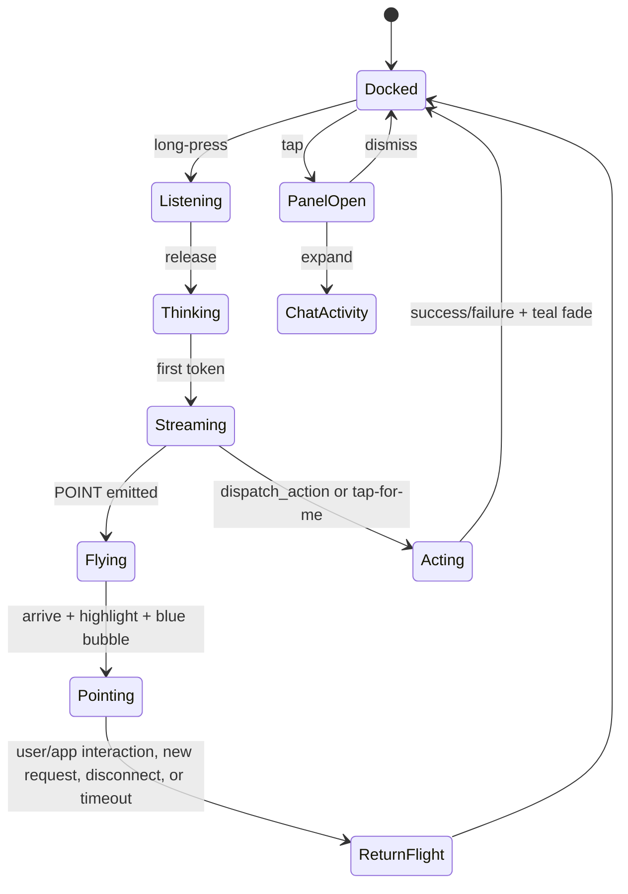

# Lane: A — general screen-aware AI copilot

# Handy Android — V2 Scope & Architecture

**Status:** authoritative V2 source of truth. Supersedes the V1-scoped sections of `Handy_Android_Build_Plan_v2.md` for everything below. The V1 plan stays valid as the baseline architecture; this document names exactly what changes or extends in V2 and what is explicitly fenced to V3.

**Tie-break rule.** If this doc, `Handy_Android_Cursor_Prompt_v2.md`, and `.cursor/rules/10-handy-project-guardrails.mdc` disagree on any V2 topic, **this doc wins**. The other two must update to match.

**Scope of V2 (one sentence).** Handy on Android becomes materially more capable (overlay chat panel as primary quick surface, bounded tap-for-me, Gemini cloud + on-device Gemini Nano fallback via `BrainRouter`, semantic pointing from the screen-text path, notification + clipboard features, Quick Settings tile, diagnostics, action audit) while the floating widget itself becomes the pointer (Unified Buddy) — without ever becoming an autonomous multi-step phone operator.

---

## 1. V2 top-level product decisions

1. **Three-module architecture is unchanged.** `:core` (pure Kotlin), `:android-runtime` (adapters, no manifest components), `:app` (manifest components + Compose UI). V2 adds new classes inside this structure; it does not reshape it.

2. **Chat history stays JSON-on-disk** (macOS-schema compatible). No Room. No migration.

3. **Two chat surfaces, one primary.** V2 ships both:
   - **Overlay chat panel** — primary quick surface. Widget tap opens the panel over the current app with context already cached (see §2 and §15 recipe #4).
   - **`ChatActivity`** — richer fallback / expanded mode (explicit user expand, image attach, longer conversations, settings / diagnostics / provider switching).

4. **Claude cloud remains the default brain.** Gemini cloud is experimental. Gemini Nano / local GenAI is a *constrained task-level* fallback, not a full chat brain.

5. **Tap-for-me is real in V2 but bounded.** Deterministic, user-requested, tightly scoped, confirmation-gated where needed, fully auditable. See §4.

6. **No local multi-step workflow runner in V2.** Do not sneak the macOS `WorkflowRunner` back in under any name. See §16 and §17.

7. **Unified Buddy UX (V2's visual identity).** The floating widget *is* the pointer. On a `[POINT]` the widget itself flies from its snapped-edge dock via Bezier arc to the resolved target bounds, then stays as a sticky pointer until user/app interaction, a new request, service disconnect, or a safety timeout returns it to dock. **No separate `PointerOverlayController` overlay ships.** Rationale in §3.

8. **SDK targets.** `minSdk 26`, `targetSdk 36`, `compileSdk 36` (per DL-017 / Play April-2026 mandate). API 37 may be a compatibility smoke lane later. See the SDK Divergence entry in `DESIGN_NOTES.md`.

---

## 2. Surfaces — what the user can touch

| Surface | Entry | Purpose |
|---|---|---|
| Floating widget (Unified Buddy) | default home | Docked glass lens; idle / listening / thinking / flying / pointing / acting / speaking. Tap → panel. Long-press → voice. Drag → snap to edge. |
| Overlay chat panel | tap widget | Primary quick chat surface. Streams replies, shows quick-prompt chips, action confirmations, expand-to-`ChatActivity` button. |
| `ChatActivity` | explicit expand, or long conversations | Full surface, image attach, history, provider switching, settings. |
| `SettingsActivity` | from panel / `ChatActivity` / tile | Brain, voice, TTS, web search, tap-for-me toggle, notification listener, clipboard features, tutor mode. |
| `DiagnosticsActivity` | from Settings | Runtime state (§10). |
| `OnboardingActivity` | first launch / settings | Permissions, prominent Accessibility / notification / clipboard disclosures, explicit consent. |
| Quick Settings tile | system pulldown | One-tap entry; user configures which of: open panel / start voice / open full chat. |
| Optional Assist entry | user-enabled | Gracefully degrades on OEMs. Never the only entry. |

Rules for the overlay chat panel (Phase 1):

- Default quick open path is widget-tap → overlay chat panel. `ChatActivity` only opens on explicit expand.
- Panel must handle IME focus correctly, orientation changes, split-screen / multi-window, overlay permission revocation, app-switch-while-open, animation interruption, and Accessibility-off reduced mode.
- Panel open / close must not leak `ComposeView`, `ViewModelStore`, `WindowManager` resources.
- Panel IME choreography is codified as recipe #5 in §15.
- Idle widget keeps `FLAG_NOT_FOCUSABLE | FLAG_LAYOUT_IN_SCREEN | FLAG_LAYOUT_NO_LIMITS`. The panel drops `FLAG_NOT_FOCUSABLE` while open and restores the idle flag set on close. `overlayFlagsFor(mode)` is still the single choke point — `OverlayMode` gains a `ChatPanel` value in V2.

Panel states (Compose `StateFlow`):

- `Hidden`
- `WidgetIdle`
- `WidgetListening`
- `WidgetThinking`
- `ChatPanelCollapsed`
- `ChatPanelExpanded`
- `PanelStreaming`
- `PanelActionConfirming`

---

## 3. The Unified Buddy — widget = pointer

The macOS app splits the two because a persistent mouse cursor anchors the companion ([`Handy V1 (macOS app)/Handy/Services/CompanionCursorManager.swift`](Handy V1 (macOS app)/Handy/Services/CompanionCursorManager.swift)). Android has no such anchor. Two overlays would also double the `OverlayComposeHost` bookkeeping, double the window grants users must reason about, and create a layering bug surface. V2 collapses the split: **the widget itself flies**.

### State machine



### Motion contract (carried from macOS, refined per cursorbuddy)

- Bezier flight duration `= clamp(distance / 800.0, 0.6, 1.4)` s.
- Arc height `= min(distance * 0.2, 80)` px.
- Smoothstep easing: `t' = t² · (3 − 2t)`.
- Triangle-tangent rotation follows the curve.
- Dwell: uniform random in `[3.0, 5.0]` s (matches macOS `PointDwellTiming.returnFlightDelayRange`).
- Flight-in easing curve: `DecelerateInterpolator(2f)` (cursorbuddy recipe — see §15).
- Landed-at-target pulse: `OvershootInterpolator(1.5f)`, 600 ms, `1.0 → 1.14 → 1.0`, repeat reverse forever, cancelled on return flight.
- Triangle rotation snaps back to `-35°` on arrival and return (macOS).

### Visual identity — the Glass Lens

The widget is a glass magnifying lens rendered as a seven-layer `Paint` composite (see §15 recipe #1). The same lens render is used in Docked, Flying, Pointing, Acting, and Speaking states — only the overlaid chrome changes:

| State | Overlay chrome on lens |
|---|---|
| Docked (idle) | warm saturation punch, amber rim glow |
| Listening | cool cyan saturation, `CompanionWaveform` bars (macOS) overlaid |
| Thinking | thin rotating angular gradient (matches macOS `CompanionSpinnerView`) |
| Flying | pulse scale 1.0 → 1.3, tangent-aligned rotation, no bubble |
| Pointing | pulse at 1.14 (Overshoot), blue label bubble beside lens |
| Acting (tap-for-me) | teal ring, teal action bubble beside lens |
| Speaking (TTS) | subtle saturation boost, green bubble beside lens |

### Bubble taxonomy — four colors, mutual exclusion

Bubbles anchor to the lens position (not the mouse, since there is no mouse).

| Color | Meaning | Source fidelity | Clamp |
|---|---|---|---|
| Yellow | transcribed voice text | macOS `overlayTranscriptBubble` | model's input; no clamp applied here |
| Teal | action-in-progress (NEW in V2) | Android-only | short (≤ 30 chars) — "tapping Send…", "opening Gmail…" |
| Green | assistant spoken response | macOS `overlayResponseBubble` | 110 chars via `clampVoiceSpokenForOverlay` |
| Blue | pointer navigation label | macOS `navigationBubble` | 30 chars; else random `navigationPointerPhrases` |

Mutual-exclusion rules:

1. Only one color bubble is visible at a time.
2. Green response suppresses the blue navigation label (macOS `suppressCompanionNavigationLabelBubble`).
3. Teal action state suppresses green response.
4. Yellow transcript fades out when processing starts.
5. Teal is a **passive status indicator, not interactive**. Confirmation chips and tap-to-confirm UX live inside the overlay chat panel, never on the lens.

### Why this is better than the two-overlay model

- One `WindowManager` view, one `OverlayComposeHost`, one `LifecycleRegistry`, one `SavedStateRegistryController`. Halves the OS-4 bookkeeping.
- No visual hand-off glitch between widget-hides / pointer-appears. The user watches one object the whole time.
- Works without a cursor concept. macOS's `CompanionCursorManager` falls back to `NSEvent.mouseLocation` — Android has no equivalent.
- When cursorbuddy-android-main's own `PointerView` and `FloatingBubble` use the **same** `LensView` render so that "the resting buddy and the guiding cursor feel like the same object" ([`PointerView.kt` L8–10](cursorbuddy-android-main/app/src/main/java/com/cursorbuddy/android/overlay/PointerView.kt)), that is production evidence that a single shared visual is the right choice. We take it one step further: same view, not just same render.

---

## 4. Tap-for-me — bounded, confirmable, audited

### Allowed in V2

- Tap visible semantic node in current foreground app.
- Long-press visible semantic node.
- Scroll one viewport (forward / back).
- Explicit directional swipe when the user requested it.
- Open notification shade / Quick Settings when explicitly requested.
- Activate clearly labelled buttons / tabs / menu items / toggles in the current app.

### Forbidden in V2

- Open-ended automation.
- Repeated retries until success.
- Hidden UI traversal (scrolling a list until it finds a target).
- Arbitrary text entry via `ACTION_SET_TEXT` into other apps.
- Multi-step chaining (do A, then B, then C).
- Cross-app plans without explicit confirmation.
- Anything that looks like autonomous operate-the-phone behavior.

### Resolution → execution contract

Before any gesture:

1. Verify `HandyAccessibilityService` is enabled.
2. Verify the target app / window still matches the expectation captured at the tap (see cache-at-tap rule, §15 recipe #4).
3. Resolve the semantic node fresh via `SemanticPointerResolver` (Strategy B). Do not guess.
4. Ensure the target is visible, enabled, and actionable.
5. If the resolved node is `isClickable`, call `node.performAction(ACTION_CLICK)` first. Fall back to `AccessibilityService.dispatchGesture` at the node's bounds center only if the node is not clickable (see §15 recipe #3 — cursorbuddy's node-first rule, adapted).
6. On failure, surface a structured `PerformResult`; do not retry in a loop.
7. Every action emits an audit entry (§4.3).

If the resolved node is stale, re-resolve once and fail. If the target sits inside a low-quality WebView tree, fall back to pointer guidance rather than brute-forcing a gesture.

### 4.1 Confirmation policy

| Confirmation required? | When |
|---|---|
| **No** | Benign one-step action in the current foreground app that the user clearly requested (e.g. "tap Send", "scroll down"). |
| **Yes** | Cross-app actions; any send / share / post / call / text; settings changes with device-wide impact; notification reply / dismiss; opening payment / purchase / submit flows; any tap where target confidence is borderline. |

Confirmation UX lives inside the overlay chat panel (`PanelActionConfirming` state), not on the lens. Teal lens bubble only appears during execution of an already-confirmed action.

### 4.2 Bounded action catalogue (extends §7 of V1 plan)

New or graduated in V2:

- SMS compose
- Calendar event create
- Reminder / task handoff where available
- App info screen
- Notification settings screen
- Accessibility settings screen
- Battery-optimization settings
- Wi-Fi / Bluetooth / App settings deep-links
- Share URL
- Start navigation intent
- System web search
- Open specific installed app by indexed label / package (via `LaunchableAppIndex`)

All of the above are dispatched through `dispatch_action`. The V1 dispatcher contract (`IntentResult` sealed type) is unchanged.

### 4.3 Action audit schema

Every performed tap-for-me or `dispatch_action` creates a structured audit entry in a rolling JSON log (bounded size; oldest pruned on write). Surfaced in `DiagnosticsActivity`.

```kotlin
data class AuditEvent(
    val timestampEpochMs: Long,
    val requestId: String,          // ties to the chat turn
    val provider: String,           // claude / gemini-cloud / gemini-nano
    val action: AuditAction,        // Tap / LongPress / Scroll / Swipe / Intent(<name>)
    val targetApp: String,          // packageName
    val semanticTarget: String,     // role + text + viewId + contentDescription snapshot
    val confirmationRequired: Boolean,
    val userConfirmed: Boolean,
    val result: AuditResult,        // Dispatched / ChooserShown / Failed(reason) / Cancelled / NotPermitted
    val failureReason: String?,
)
```

The schema lives in `:core/audit/AuditEvent.kt` (V2 addition). Storage adapter lives in `:android-runtime/audit/AuditStore.kt`.

---

## 5. Brains — V2 model architecture

Three tiers:

1. **Claude cloud** — default primary. Full multimodal, full tool use, best macOS-parity on prompts and behaviours.
2. **Gemini cloud** — experimental second cloud provider behind the same `LlmClient` contract. Optional in settings. Not default until parity tests pass.
3. **Gemini Nano / local on-device GenAI** — bounded, task-level fallback only. Not a drop-in replacement for full cloud chat.

### 5.1 Interfaces (:core additions)

```kotlin
interface LlmClient {
    fun streamChat(request: LlmRequest): Flow<LlmChunk>
    val modelId: String
}

interface LocalGenAiClient {
    suspend fun isAvailable(): LocalAvailability
    suspend fun supports(task: LocalTask): Boolean
    suspend fun run(request: LocalGenAiRequest): LocalGenAiResult
    val modelId: String
}

enum class LocalTask {
    SUMMARIZE_TEXT,
    REWRITE_TEXT,
    TRANSLATE_TEXT,
    SCREEN_TEXT_QA,
    NOTIFICATION_SUMMARY,
    CLIPBOARD_TRANSFORM,
    SHORT_TITLE_OR_LABEL,
}

sealed class LocalAvailability {
    data object Available : LocalAvailability()
    data object Downloading : LocalAvailability()
    data object Unsupported : LocalAvailability()
    data class TemporarilyUnavailable(val reason: String) : LocalAvailability()
}
```

`LlmClient` is unchanged from V1. `LocalGenAiClient` is the only new core interface.

### 5.2 BrainRouter (new, :core)

```kotlin
class BrainRouter(
    private val claude: LlmClient,
    private val geminiCloud: LlmClient?,
    private val localGenAi: LocalGenAiClient?,
    private val settings: AppSettings,
) {
    fun route(task: AssistantTask): BrainDecision
}

sealed class BrainDecision {
    data class UseCloud(val client: LlmClient) : BrainDecision()
    data class UseLocal(val client: LocalGenAiClient, val localTask: LocalTask) : BrainDecision()
    data class FailGracefully(val message: String) : BrainDecision()
}
```

Default routing order:

1. Claude cloud if configured and the task needs full capability (tools / web search / image reasoning / long context / multi-turn assistant).
2. Gemini cloud if the user selected it or Claude is unreachable.
3. Gemini Nano local **only** if all of: task is explicitly in the `LocalTask` whitelist; device has AICore / GenAI capability; local model is ready (not downloading); user setting `allowLocalAi` is true; request requires no tools / web search / image reasoning / long context.
4. Else a graceful `FailGracefully` with a clear user message.

Privacy-mode routing (`settings.preferLocalWhenPossible = true`):

- Eligible text-only tasks run on `LocalGenAiClient` first.
- Fall back to cloud only when the task is unsupported locally or the device is unavailable.

No-network fallback:

- If no cloud provider is reachable but local AI is available, allow only `LocalTask` whitelist work. Surface a clear "limited offline mode" banner in the panel.

### 5.3 Local GenAI — allowed and forbidden

**Allowed V2 tasks** (maps to `LocalTask`):

- Summarize copied text
- Summarize accessibility-tree screen text
- Rewrite / shorten / expand text
- Translate text
- Explain a visible notification cluster
- Label / title generation for UI summaries

**Forbidden V2 uses of local AI** — ever:

- Web search
- Image grounding from screenshots
- Tool planning
- Action selection
- Cross-app automation
- Arbitrary open-ended chat with large context
- Multi-turn memory-heavy assistant sessions

### 5.4 Edge cases (both GeminiNano and cloud)

Local:
- Unsupported device / AICore unavailable.
- Model not installed / still downloading.
- Model warm-up latency.
- Low memory / thermal throttling.
- Battery saver mode.
- Local task too large for safe prompt budget.
- Output empty / malformed.
- Local unsupported but user asked for "local only" — surface clear failure.

UX rules:
- Never silently pretend local AI is equivalent to cloud.
- Label local mode clearly in Diagnostics.
- If local mode is limited, say so.
- Local outputs cannot directly trigger action tools.
- Local outputs go through the same post-validation / moderation / truncation rules.

Cloud Gemini:
- Same `LlmClient` contract as Claude.
- Same tool-use abstraction.
- Same markup parsing.
- Own provider setting — experimental by default.
- Parity tests against a shared prompt fixture set before it can be default.

---

## 6. Capture & grounding — the RequestBudgeter

Smarter capture in V2. Preferred order is unchanged (OS-3: API 34+ `takeScreenshotOfWindow(activeWindowId)` → API 30–33 `takeScreenshot()` → API 26–29 MediaProjection). What changes: **what we send at all**.

### 6.1 RequestBudgeter (new, :core)

```kotlin
class RequestBudgeter(
    private val screenInputRouter: ScreenInputRouter,
    private val marks: AccessibilityMarksProvider,
    private val capture: ScreenCapturePipeline,
) {
    suspend fun budget(userMessage: String, mode: ScreenInputMode): BudgetedRequest
}

data class BudgetedRequest(
    val screenText: ScreenTextSnapshot?,
    val accessibilityMarks: List<AccessibilityMark>?,
    val image: CaptureResult?,
    val captureMode: CaptureMode,
)

enum class CaptureMode {
    TEXT_ONLY,          // screen-text only, no image
    FOCUSED_WINDOW,     // takeScreenshotOfWindow + marks
    CURRENT_DISPLAY,    // full takeScreenshot + marks
    BROADER,            // current display + neighbouring window context (rare)
    NONE,               // marks + text only, no capture needed
}
```

Decision rules:

- If screen-text is enough (summarize, translate, read), send no image. `CaptureMode.TEXT_ONLY`.
- If one focused window is enough (point at button on current screen), prefer `takeScreenshotOfWindow`. `CaptureMode.FOCUSED_WINDOW`.
- If the overlay panel is open and the target window is known, prefer window capture (cheaper, per-window secure flags honoured).
- Never send a `SecureWindow`, `NotPermitted`, `Unsupported`, or `Failed` frame to `LlmClient`. OS-5 rule is unchanged.
- Only send broader capture when the user's question clearly needs it ("what's on the edges", "read across the whole screen").
- Always include accessibility marks when available — they are cheap and ground the model.

### 6.2 AccessibilityMarksProvider (new, :android-runtime)

See §15 recipe #2 for the port contract. Exposes a compact JSON of visible actionable UI elements:

- buttons, tabs, menu items, toggles
- fields and placeholders (non-password)
- safe content descriptions

Excludes:

- secure field values
- passwords
- long document / message bodies (truncated)
- hidden nodes / zero-size nodes
- arbitrary sensitive content

---

## 7. Semantic pointing in V2

V2 extends Strategy B semantic pointing to three input paths:

1. Vision path (unchanged from V1).
2. **Screen-text path (NEW in V2).** When the request routed `TextOnly` or `Both`, the LLM can still emit a `[POINT]` referencing a `text` / `viewId` / `contentDescription` present in the `<screen_ui>` block. The runtime resolves against live `AccessibilityNodeInfo` as usual.
3. **Accessibility marks path (NEW in V2).** When marks are sufficient and the model has a high-confidence match, no image needs to be sent. Resolver uses the marks' `viewId` / `text` as hints.

### 7.1 Resolver fallback chain

1. Exact `text` + `role` match.
2. `contentDescription` match.
3. `viewId` suffix match.
4. Fuzzy text (Levenshtein ≤ 2, case-insensitive).
5. Fail safely. **Never** fall back to Strategy A pixel-coordinate generation.

If a mark lookup gave us a viewId hint, start at step 3; if it matches, promote to Phase 4 (fuzzy) only when confidence is low.

---

## 8. Notification listener — narrow V2 scope

New `HandyNotificationListenerService` in `:app` behind the `NOTIFICATION_LISTENER_SERVICE` binding. Opt-in via onboarding disclosure + settings toggle.

### 8.1 Core V2 features

- Summarize recent notifications.
- Read top notification text safely.
- Open the source app from a notification summary.
- Filter by app / package.
- Group notifications by app or conversation.

### 8.2 Optional / guarded V2 features

- Explicit dismiss notification action (requires confirmation + audit).
- Explicit reply via `RemoteInput` (requires confirmation + audit).

### 8.3 Forbidden in V2 (pushed to V3)

- Ambient autonomous notification triage.
- "Auto-reply while I'm away".
- Rule engines.

### 8.4 Edge cases to handle explicitly

- Permission revoked while running.
- Work-profile notifications.
- Redacted lock-screen / private notifications.
- Grouped notifications.
- Media / ongoing notifications.
- Bubble notifications.
- Stale notification keys.
- Apps with custom remote views.

---

## 9. Clipboard features — helpful, not creepy

New `:android-runtime/clipboard/ClipboardAssist.kt` tied to **visible Handy state or explicit user request** only.

### 9.1 Allowed V2 features

- Summarize copied text.
- Rewrite / translate copied text.
- Explain copied error / message / code snippet.
- Share transformed clipboard text back to the user.
- Optional clipboard hint chip in panel / widget when the user has just copied text (only while Handy is visible).

### 9.2 Rules

- **No ambient hidden clipboard surveillance.** Ever.
- No always-on background harvesting.
- Access tied to visible Handy state or explicit user request.
- Do not repeatedly process the same clip (dedupe by hash).
- Size-cap large clips (32 KB); ignore unsupported / binary clips unless explicitly handled.
- Detect password / OTP / highly sensitive-looking clips conservatively and avoid auto-processing.
- When Handy writes sensitive transformed text back to clipboard, mark it sensitive where supported (API 33+ `EXTRA_IS_SENSITIVE`).

### 9.3 Edge cases

- Background clipboard restrictions on Android 10+.
- Android 13 system clipboard preview duplication.
- Image / URI clips.
- Work-profile clipboard separation.
- Same-text duplicate clips.
- Clipboard permission / access exceptions on OEMs.

---

## 10. DiagnosticsActivity

New activity in `:app`. Surfaces runtime state as a clean read-only view (Compose `LazyColumn`).

Required fields:

- Overlay permission state.
- Accessibility enabled state (`StateFlow` from `HandyAccessibilityService` — no polling; see §15 recipe #10).
- Notification access state.
- Microphone permission.
- Speech recognizer availability.
- On-device speech availability.
- Current foreground app / package / tool.
- Current browser / site label (umbrella).
- Current capture mode from the last request.
- Last screenshot result (`CaptureResult` variant + size).
- Secure-screen state.
- Current provider (cloud + local).
- Local GenAI availability / capability list.
- Last model error.
- Last tool call.
- Last action audit result (tap-for-me or `dispatch_action`).
- Recent audit tail (last 20 events).

---

## 11. Quick Settings tile, launcher, Assist entry

### 11.1 Quick Settings tile

`HandyQuickSettingsTileService` in `:app`. User picks behaviour in settings:

- Open panel (default).
- Start voice.
- Open full chat.

Support one-tap add flow where platform allows (`TileService.requestAddTileService` API 33+).

### 11.2 Launcher / home polish

Launcher icon opens `ChatActivity` directly (not onboarding, unless first-launch flag not set). Adaptive icon, themed icon, monochrome launcher support.

### 11.3 Optional Assist entry

`HandyAssistIntentService` (the voice-interaction role) gated by an explicit user-enabled setting. Must gracefully degrade on OEMs where `VoiceInteractionService` is inconsistent. **Never the only way to access Handy.**

---

## 12. Tutor mode — bounded V2 enablement

Tutor mode is opt-in; default off for new users. Full prompt from macOS (`tutorModeSystemPrompt`) is already ported.

### 12.1 Can do in V2

- Observe current app context.
- Explain visible UI.
- Give proactive nudges after idle.
- Point.
- Use screen-text path heavily.
- Use `LocalGenAiClient` for summarization where appropriate.

### 12.2 Must NOT do in V2

- Run a continuous local workflow runner.
- Autonomously click through the UI.
- Create open-ended loops.

### 12.3 Guardrails

- Max observation cadence (one nudge per 60 s minimum).
- Per-app cooldowns.
- Suspend on battery-saver / thermal throttling.
- Stop on app switch or user interrupt.
- Clear disclosure in settings.

---

## 13. Policy / disclosure — ship blockers (extends V1 §18a)

Must ship with:

- Prominent Accessibility disclosure + explicit consent.
- Notification-access disclosure (if user enables it).
- Clipboard feature disclosure (if user enables it).
- Privacy policy updated for V2 data paths (local AI lives on-device; cloud providers listed; notification / clipboard behaviour described).
- Play declaration artifacts for V2 (tap-for-me explicitly declared + demo video; notification listener declared; `QUERY_ALL_PACKAGES` explicitly NOT requested).
- Auditability demo: show the DiagnosticsActivity audit tail during Play review.

Absolutely do NOT frame Handy as:

- Autonomous phone operator.
- Self-directed agent.
- Background controller that acts on its own.

---

## 14. Testing requirements

Add / expand:

- Overlay chat panel open / close / IME behaviour.
- Overlay lifecycle under rotation and multi-window.
- Semantic point from screen-text path.
- Tap-for-me success / failure / confirmation gating.
- Action audit logging.
- Gemini cloud contract tests (same fixture set as Claude).
- `LocalGenAiClient` availability gating.
- Local fallback routing via `BrainRouter`.
- Notification access flows.
- Clipboard feature flows.
- Diagnostics screen correctness.
- Quick Settings tile behaviour.
- Foreground app / package / site resolution.
- `RequestBudgeter` path selection.
- Secure-screen handling (OS-5 regression suite).
- Tutor mode cadence / stop conditions.
- Unified Buddy state machine: every transition from §3.
- Glass Lens render correctness (golden image) in Docked / Listening / Thinking / Flying / Pointing / Acting / Speaking.
- Bezier flight duration and arc height per the motion contract in §3.
- Node-first tap vs gesture fallback branch (§15 recipe #3).
- Cache-at-tap snapshot rule (§15 recipe #4).

---

## 15. Borrowings from `cursorbuddy-android-main`

[`cursorbuddy-android-main`](cursorbuddy-android-main) (AGPL-3.0, jasonkneen) is an Android build of a multi-step tutorial runner — effectively the V3 product we have fenced out. Several of its sub-systems are production-grade and map cleanly onto V2 slices. **We port recipes, techniques, and numeric constants — never Kotlin source lines.** Every recipe below is a clean-room reimplementation of the idea in our own Compose / adapter code so no AGPL surface lands in Handy. See `DESIGN_NOTES.md` entry "cursorbuddy licensing".

### Port verbatim (design + recipe), adapt to Compose / our modules

**Recipe #1 — Seven-layer Glass Lens render.** Ported from [`cursorbuddy-android-main/app/src/main/java/com/cursorbuddy/android/overlay/PointerView.kt`](cursorbuddy-android-main/app/src/main/java/com/cursorbuddy/android/overlay/PointerView.kt) (and mirrored on their docked bubble in [`FloatingBubble.LensView`](cursorbuddy-android-main/app/src/main/java/com/cursorbuddy/android/overlay/FloatingBubble.kt)). Seven layers:

1. Drop shadow (`setShadowLayer(14f, 0f, 6f, 0x66000000)`).
2. Lens body — `RadialGradient(cx - r·0.25, cy - r·0.25, r·1.1, [0x30FFFFFF, 0x18AEE9FF, 0x22000000], [0, 0.65, 1])`.
3. Saturation punch — `RadialGradient(cx, cy, r·0.95, [0x66FFB347, 0x3340E0FF, 0x00000000], [0, 0.55, 1])`.
4. Inner-shadow ring — STROKE, `strokeWidth = r·0.22`, radial `[0, 0, 0x55000000]`.
5. Chrome sweep rim — STROKE, `strokeWidth = 3f`, `SweepGradient(cx, cy, [0xFFFFFFFF, 0xFFB3E5FC, 0xFF81D4FA, 0xFFFFFFFF, 0xFFB3E5FC, 0xFFFFFFFF])`.
6. Top-left specular — `RadialGradient` `[0xCCFFFFFF, 0x33FFFFFF, 0x00FFFFFF]`, oval `RectF(cx-r·0.7, cy-r·0.8, cx+r·0.05, cy-r·0.1)`.
7. Bottom-right secondary specular — small `RadialGradient` `[0x66FFFFFF, 0x00FFFFFF]` at `(cx + r·0.4, cy + r·0.5)`, radius `r·0.25`.

Render inside a Compose `Canvas` or a small `AndroidView { LensView(it) }` wrapper. Must keep `setLayerType(LAYER_TYPE_SOFTWARE)` for `setShadowLayer` to render. Parameters: `lensBaseScale = 0.82f` at rest, `pulseScale = 1.0f → 1.14f` during `Pointing`. This is the Unified Buddy's visual identity in §3.

**Recipe #2 — Compact Accessibility-marks JSON.** Ported from [`UiTreeSerializer.toCompactJson`](cursorbuddy-android-main/app/src/main/java/com/cursorbuddy/android/service/UiTreeSerializer.kt) and `isInteresting(node)`. Feed exactly this shape into the screen-text addendum and the semantic resolver:

```json
[
  {
    "text": "Send",
    "desc": "Send message",
    "id": "send_btn",
    "type": "Button",
    "bounds": [120, 600, 280, 660],
    "clickable": true
  }
]
```

- 50-node cap.
- Drop any node with `bounds.width() <= 0 || bounds.height() <= 0`.
- Keep a node only if it has non-blank `text`, non-blank `contentDescription`, OR is `isClickable || isScrollable || isEditable`.
- `id` is `viewIdResourceName.substringAfterLast("/")` — stripping the package prefix keeps the prompt compact.
- Suppress `password` fields (flag `password: true` but never `text`).

Lands in `:android-runtime/accessibility/AccessibilityMarksProvider.kt` (Phase 2).

**Recipe #3 — Node-first, gesture-second tap.** Ported from [`ActionPerformer.performTap` L42–78](cursorbuddy-android-main/app/src/main/java/com/cursorbuddy/android/service/ActionPerformer.kt). In the V2 `AccessibilityGestureActionPerformer`:

```
1. SemanticPointerResolver.resolve(spec) -> AccessibilityNodeInfo?
2. If node != null AND node.isClickable:
     node.performAction(AccessibilityNodeInfo.ACTION_CLICK)
     return PerformResult.Ok (or .Failed per performAction result)
3. Else if node != null AND node.isLongClickable AND spec is long-press:
     node.performAction(ACTION_LONG_CLICK)
4. Else fall back to AccessibilityService.dispatchGesture at node's bounds center
   (or resolved AtScreenPoint).
```

Node-first respects disabled state, fires the real click handler, and avoids misfires from coordinate-hit on overlapping nodes. Lands in Phase 3.

**Recipe #4 — Cache-at-tap snapshot.** Ported from [`OverlayManager.onBubbleTapped` L313–322](cursorbuddy-android-main/app/src/main/java/com/cursorbuddy/android/overlay/OverlayManager.kt). The overlay presenter caches `(packageName, umbrellaSiteLabel, accessibilityMarksSnapshot, captureHint, timestampEpochMs)` **the instant the widget is tapped or long-pressed**. The overlay chat panel and the voice pipeline consume the cached snapshot. Rationale: opening the panel with `FLAG_NOT_TOUCH_MODAL` still lets a re-layout change which window is "active" in Accessibility terms, so live reads from `rootInActiveWindow` inside the panel are unreliable.

Rule applies anywhere we read Accessibility state inside a panel that took focus. Lands in Phase 1 and Phase 3.

**Recipe #5 — Overlay chat panel IME choreography.** Ported from [`OverlayManager.showInputPanel` L125–172](cursorbuddy-android-main/app/src/main/java/com/cursorbuddy/android/overlay/OverlayManager.kt):

```
WindowManager.LayoutParams(
    width,
    WRAP_CONTENT,
    TYPE_APPLICATION_OVERLAY,
    FLAG_NOT_TOUCH_MODAL or FLAG_LAYOUT_IN_SCREEN or FLAG_WATCH_OUTSIDE_TOUCH,
    PixelFormat.TRANSLUCENT,
).apply {
    softInputMode = SOFT_INPUT_ADJUST_PAN
}

// After attach:
handler.postDelayed({
    editText.requestFocus()
    imm.toggleSoftInput(InputMethodManager.SHOW_FORCED, 0)
}, 200)
```

OS-2 still holds: idle widget keeps `FLAG_NOT_FOCUSABLE`. Only the panel drops it. `overlayFlagsFor(OverlayMode.ChatPanel)` returns the flag set above; `overlayFlagsFor(OverlayMode.IdleWidget)` is unchanged.

**Recipe #6 — Voice auto-submit 300 ms grace.** Ported from [`OverlayManager.onResult` L444–451](cursorbuddy-android-main/app/src/main/java/com/cursorbuddy/android/overlay/OverlayManager.kt). On a final STT result: fill the panel input field, wait 300 ms, auto-submit through the normal chat pipeline with `fromVoice = true`. Empty release is still a no-op. This feels smoother than requiring a Send tap after every voice turn.

**Recipe #7 — `FLAG_INCLUDE_NOT_IMPORTANT_VIEWS` on the Accessibility service.** Ported from [`xml/accessibility_service_config.xml`](cursorbuddy-android-main/app/src/main/res/xml/accessibility_service_config.xml). Add `flagIncludeNotImportantViews` to the `accessibilityFlags` mask in our `handy_accessibility_service.xml`. Some apps mark legitimate UI as `importantForAccessibility=no`; we need to see them. The tree bloat is contained by recipe #2's `isInteresting` filter.

**Recipe #8 — Glassmorphism palette + bounded backdrop snapshot blur.** Observed in [`OverlayManager.enableBackdropBlur` L464–474](cursorbuddy-android-main/app/src/main/java/com/cursorbuddy/android/overlay/OverlayManager.kt) — deliberate no-op with the comment "blurring the whole screen behind overlays looks wrong. We keep the frosting in the panel styling itself." We keep that taste call for the full-screen panel/input window and do not use cross-window blur. If real blur is needed, Handy captures a pre-panel screenshot and blurs only the crop drawn inside the rounded sheet:

- Glass is a surface treatment: `Brush.linearGradient` top-left to bottom-right with two-stop palette, 1 dp hairline stroke, 20–22 dp radius, software-layer drop shadow.
- Do **not** use `WindowManager.LayoutParams.FLAG_BLUR_BEHIND` on Handy overlay windows. It can blur the full display behind `TYPE_APPLICATION_OVERLAY` on real devices. `RenderEffect` / Compose blur is allowed only on Handy-owned bitmap content clipped to the sheet, with dense no-blur glass as the fallback.
- Applies to overlay chat panel, caption / action / response / navigation bubbles, and DiagnosticsActivity cards.

**Recipe #9 — Per-app quick-prompt chips on panel cold-start.** Idea from [`AppDetector.getQuickPrompts`](cursorbuddy-android-main/app/src/main/java/com/cursorbuddy/android/service/AppDetector.kt) + [`InputPanel.setQuickPrompts`](cursorbuddy-android-main/app/src/main/java/com/cursorbuddy/android/overlay/InputPanel.kt). Reimplement in `:core/prompts/QuickPromptCatalog.kt` backed by `LaunchableAppIndex`. Category list: `Settings, Browser, Messaging, Social, Email, Maps, Camera, Phone, Files, Music, Video, Gallery, Calendar, Clock, Calculator, Store, Finance, Health, Food, Travel, Productivity, Unknown`. Panel shows 3–4 chips based on the cached package from recipe #4. Unknown packages show `"Show me around" / "What can I do here?" / "Find the settings" / "Help me navigate"`.

**Recipe #10 — `StateFlow<AccessibilityConnectionState>` instead of polling.** Cursorbuddy polls 20× every 500 ms in [`CursorBuddyService.onStartCommand` L62–73](cursorbuddy-android-main/app/src/main/java/com/cursorbuddy/android/service/CursorBuddyService.kt). We do not. Rule:

```kotlin
sealed class AccessibilityConnectionState {
    data object Connected : AccessibilityConnectionState()
    data object Disconnected : AccessibilityConnectionState()
    data object NeverConnected : AccessibilityConnectionState()
}

// In HandyAccessibilityService:
override fun onServiceConnected() { _state.value = Connected }
override fun onDestroy() { _state.value = Disconnected }
```

`AssistantForegroundService`, `OverlayPresenter`, `DiagnosticsActivity`, and the onboarding "enable Accessibility" banner observe this `StateFlow`. No polling, no `@Volatile` flag-chasing.

### Improve on cursorbuddy

- Keep macOS's distance-based Bezier math (§3) but adopt cursorbuddy's `DecelerateInterpolator(2f)` for the flight-in curve and `OvershootInterpolator(1.5f)` `1.0 → 1.14` pulse on arrival. Matches the "settle and nudge" visual.
- Cursorbuddy's `TargetHighlight` (fill + glow stroke + white border, 18 dp radius) is a nice landed-at-target affordance — port the visual into the blue-bubble state; but **do not** draw it around arbitrary bounds computed by the LLM (Strategy A). Only draw it once `SemanticPointerResolver` has a real `AccessibilityNodeInfo`.

### Do NOT borrow

1. **`TutorialEngine` multi-step runner** ([`tutorial/TutorialEngine.kt`](cursorbuddy-android-main/app/src/main/java/com/cursorbuddy/android/tutorial/TutorialEngine.kt), [`overlay/TutorialControls.kt`](cursorbuddy-android-main/app/src/main/java/com/cursorbuddy/android/overlay/TutorialControls.kt)). Pause / resume / next / prev / replay of an N-step workflow IS the V3 product. Fenced in §16.
2. **Strategy A pixel-bounds pointing from the LLM** ([`ClaudeAIPlanner.kt` L50–59](cursorbuddy-android-main/app/src/main/java/com/cursorbuddy/android/service/ClaudeAIPlanner.kt) — LLM emits `bounds: [l, t, r, b]`). Violates our Strategy B mandate. The runtime never generates or consumes pixel-coordinate `[POINT]` at runtime.
3. **Orphaned `FOREGROUND_SERVICE_MEDIA_PROJECTION` permission** ([`AndroidManifest.xml` L19, L42–45](cursorbuddy-android-main/app/src/main/AndroidManifest.xml)). Cursorbuddy declares the permission but has no service of type `mediaProjection`, so their capture silently fails on API 34+. Our OS-1 rule already prevents this — the anti-example reinforces it.
4. **View + XML UI** with a monolithic `OverlayManager` that hands raw parents to child views. We stay Compose-first. We port Paint recipes, not View class hierarchies.

---

## 16. V3 fence (do NOT build in V2)

Duplicated in `.cursor/rules/10-handy-project-guardrails.mdc` as forbidden:

- Continuous multi-step workflow runner (no `WorkflowRunner` from macOS; no `TutorialEngine`-style runner from cursorbuddy).
- Autonomous initiate-plan-execute loops.
- Arbitrary text entry via accessibility into other apps (`ACTION_SET_TEXT` broadly).
- Ambient notification auto-triage / auto-reply / auto-dismiss rule engines.
- Ambient clipboard surveillance / always-on clipboard harvesting.
- Wear OS / Android Auto.
- On-device image reasoning via Gemini Nano (V2 local AI is text-first only).

`cursorbuddy-android-main` is a near-complete reference implementation of items 1–2 above. If a V2 PR starts to look like cursorbuddy's `TutorialEngine` + `TutorialControls` + `ClaudeAIPlanner` loop, stop and revert.

---

## 17. V2 execution phases

Each phase ends with named acceptance checks and a green build.

### Phase 0 — source-of-truth alignment (this document)

- Align local docs + rules with the V2 prompt.
- Keep V1 docs intact; add V2 docs alongside.
- `compileSdk / targetSdk = 36` confirmed (see DESIGN_NOTES SDK Divergence entry).

**Acceptance:** this doc exists; V1 plan has a supersession banner; cursor prompt has a V2 Phase section; guardrails rule has a "V2 extensions" section; DESIGN_NOTES has the four new entries.

### Phase 1 — overlay chat panel

- Panel surface (Compose).
- IME focus-flag choreography per recipe #5.
- Expand-to-`ChatActivity` path.
- Lifecycle stability under rotation / multi-window / overlay revocation / app switch.
- Quick-prompt chips per recipe #9.
- Voice auto-submit per recipe #6.
- Glassmorphism palette + no backdrop-blur per recipe #8.
- `OverlayComposeHost` reused (no second host).

**Acceptance:** tap widget → panel opens in ≤ 250 ms → typing commits characters → IME resizes correctly → rotation does not crash → dismiss restores idle widget with original flag set.

### Phase 2 — smarter capture + grounding + Unified Buddy

- `RequestBudgeter` (§6).
- `AccessibilityMarksProvider` per recipe #2.
- Semantic point-from-text path (§7).
- `LaunchableAppIndex` hardening (refresh on `PACKAGE_ADDED / REMOVED / REPLACED`, no `QUERY_ALL_PACKAGES`).
- Diagnostics plumbing foundations (§10 read-only hooks).
- Glass Lens render per recipe #1.
- Bezier flight + sticky pointing + four-color bubble renderer per §3.
- `StateFlow<AccessibilityConnectionState>` per recipe #10 (replaces V1 polling).

**Acceptance:** a `[POINT]` emitted from a pure-text request flies the Unified Buddy to the resolved semantic target; arrives inside 1.4 s; stays as a sticky blue navigation pointer until interaction/cancel/timeout; then returns to dock. Screen-text-only request to Claude omits the image. Capture pipeline classifies a `FLAG_SECURE` test window as `SecureWindow` and the orchestrator injects the "can't see this screen" system message without calling `LlmClient` with an image.

### Phase 3 — tap-for-me

- Real `AccessibilityGestureActionPerformer` replaces `NoopActionPerformer` (Hilt binding flip).
- Node-first / gesture-second recipe #3.
- Cache-at-tap rule #4.
- Confirmation policy (§4.1).
- Bounded action catalog (§4.2).
- Action audit (§4.3).
- Teal lens bubble + `PanelActionConfirming` panel state wiring.

**Acceptance:** user says "tap Send" → Buddy confirms (non-destructive, no confirmation), flies to the Send node, lens turns teal, `node.performAction(ACTION_CLICK)` fires, audit entry appears in Diagnostics. User says "share this link" (destructive) → panel shows confirmation chip → user confirms → action fires → audit entry includes `userConfirmed = true`. Disabled button → `PerformResult.Failed("node not clickable")`, no gesture fires.

### Phase 4 — brains expansion

- `GeminiCloudLlmClient` (:android-runtime) + contract tests.
- `LocalGenAiClient` interface (:core) + `GeminiNanoLocalGenAiClient` (:android-runtime).
- `BrainRouter` (:core) (§5.2).
- Provider + local-AI + privacy-mode settings surface.

**Acceptance:** provider toggle in Settings swaps brain end-to-end without app restart. Shared contract test runs against both Claude and Gemini cloud. Local-only toggle routes `SUMMARIZE_TEXT` to Nano when available; falls back to cloud when not.

### Phase 5 — system surfaces

- Quick Settings tile (§11.1).
- Launcher / home icon polish (§11.2).
- Optional Assist entry (§11.3).

**Acceptance:** tile add flow works on API 33+. Launcher icon opens `ChatActivity`. Assist setting is off by default; enabling it routes voice invocation to Handy; disabling it restores OEM default.

### Phase 6 — notification listener + clipboard

- `HandyNotificationListenerService` (§8).
- Clipboard assist (§9).
- Permission / disclosure UX for both.
- Diagnostics expansion.

**Acceptance:** user enables notification access via in-app disclosure → recent-notifications summary works → reply-via-RemoteInput requires confirmation and writes audit. Clipboard summarize works from a visible panel; does not auto-process a password-shaped clip.

### Phase 7 — tutor mode enablement

- Bounded tutor mode per §12.
- Cadence + cooldown logic.
- Screen-text-heavy tutoring.
- Local summarization path where applicable.

**Acceptance:** tutor mode fires at most one nudge per 60 s, suspends under battery saver, stops on app switch, does NOT chain multi-step actions.

### Phase 8 — hardening / policy / beta

- Play disclosure package for V2.
- Policy pass.
- Device matrix (Pixel 6a / Samsung A-class / Motorola Moto G / OnePlus Nord / Redmi Note).
- Performance pass (cold start, drag fps, panel open latency, Bezier flight fps).
- `DEBUG_LOG.md` hardening.

**Acceptance:** DEBUG_LOG tail is silent for ≥ 1 week; all §13 deliverables present; Play internal testing beta live.

---

## 18. Turn-by-turn discipline (every V2 coding turn)

State in chat before writing code:

- Phase.
- Exact scope slice.
- Acceptance check this turn advances.
- Files to touch.
- Interfaces NOT to change.
- Risks / edge cases accounted for.
- Any DEBUG_LOG Prevention Rules that apply.

Keep changes surgical. Do not expand scope. Do not smuggle V3 in. Do not change macOS-ported prompts casually.
